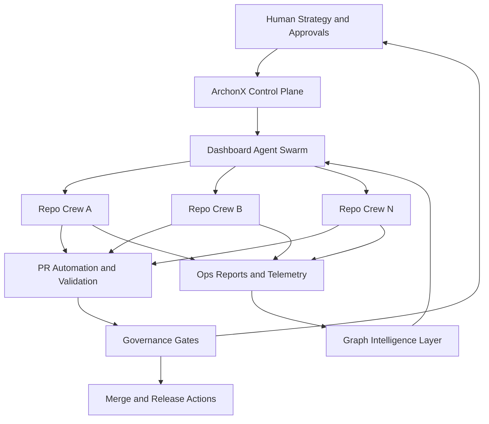

# ARCHONX Autonomous Agency Blueprint

## 1. Purpose and Strategic Outcome

ArchonX OS is the enterprise control hub for autonomous multi-repo operations across delivery, lead generation, and business workflows with minimal human load.

This blueprint defines the governance and architecture foundation for:
- autonomous execution under **PAULIWHEEL**
- cross-repo standardization and centralized control through `dashboard-agent-swarm`
- stable operating capacity aligned with the human-load target of less than three hours per day for approvals and exception handling
- brand normalization across all outward and internal artifacts using:
  - `THE PAULI EFFECT™`
  - `Yappyverse™`
  - `La Mariposa` for Ivette

## 2. Enterprise Scope and Governance Boundaries

### 2.1 In Scope
- Multi-repo orchestration under ArchonX control plane
- Agent-driven planning, implementation, testing, reporting, and pull request automation
- Business-ops workflows including lead-generation pipelines and repo-level service delivery flows
- Governance enforcement across repositories via policy contracts and machine-verifiable reports
- Central observability through `dashboard-agent-swarm`

### 2.2 Out of Scope
- Replacing legal, compliance, tax, or security authority decisions
- Autonomous production changes without required approval gates when risk tier mandates human sign-off
- Any unmanaged side-channel workflows outside ArchonX governance contracts

### 2.3 Governance Boundaries
- Every repo participating in ArchonX operations must adopt the mandatory standards package in Section 6
- No agent may bypass `PAULIWHEEL` + beads loop for code-affecting work
- Any repo without current ACK compliance is treated as restricted for write operations
- Governance precedence order:
  1. Enterprise safety and legal constraints
  2. ArchonX governance contracts
  3. Repo-local conventions

## 3. Operating Principles and Non-Negotiables

### 3.1 Operating Principles
1. Control-plane-first orchestration over ad hoc repo-local automation
2. Machine-verifiable evidence for each execution cycle
3. Human attention reserved for approvals, exceptions, and strategic direction
4. Deterministic workflows over hidden implicit behavior
5. Reusable standards over bespoke per-repo process drift

### 3.2 Non-Negotiables
- **PAULIWHEEL default** for all coding agents
- beads + Ralphy loop required: PLAN, IMPLEMENT, TEST, EVALUATE, PATCH, REPEAT
- Agent Lightning bootstrap is mandatory before other functional changes in touched repos
- Scheduled sync cadence and ACK requirements must remain enforceable
- `archonx-ops doctor` reporting must be generated and published in machine-readable format
- Brand normalization terms must be enforced in templates, prompts, and publishing outputs

## 4. Role Matrix: Agents vs Humans

| Role | Primary Owner | Responsibilities | Decision Rights | Escalation Trigger |
|---|---|---|---|---|
| Control Plane Governor | Agent | Policy checks, run admission, workflow routing | Can block non-compliant runs | Missing ACK, policy violation, unknown risk |
| Orchestration Coordinator | Agent | Cross-repo sequencing, dependency ordering, queue control | Can schedule and reschedule runs | Deadlock, conflicting repo state |
| Repo Execution Crew | Agent | Execute beads cycle, open PRs, run tests, generate artifacts | Can implement within approved scope | Sensitive files, failing quality gates |
| Reporting and Evidence Agent | Agent | Emit `archonx-ops doctor` reports and metrics contracts | Can publish status and trend packs | Report schema drift, telemetry gap |
| Dashboard Agent Swarm | Agent | Consolidate state, KPI views, control toggles | Can surface recommended actions | Untriaged critical alerts |
| Human Principal Architect | Human | Strategy, policy changes, conflict arbitration | Final authority on policy and architecture changes | Multi-repo risk, governance exception |
| Human Approver | Human | Approval of high-risk merges and production-impact actions | Final sign-off for gated actions | Risk tier requires human approval |
| Human Operator of Last Resort | Human | Emergency intervention and rollback authorization | Can halt automation globally | Incident severity threshold breached |

### 4.1 Human-in-the-Loop Boundaries
- Default mode is low-human-load autonomous flow
- Human involvement is constrained to:
  - policy updates
  - risk-tier approvals
  - incident response
  - unresolved conflict arbitration
- All other workflow states should remain agent-handled

## 5. System Architecture Layers

### 5.1 Layer Definitions
1. **Control Plane Layer**
   - Global policy enforcement
   - Identity, trust state, ACK status, run admission control
   - Enterprise directives and brand normalization policy

2. **Orchestration Layer**
   - `dashboard-agent-swarm` state manager
   - Multi-repo DAG planning and run queue
   - Exception routing and approval gate injection

3. **Repo Execution Layer**
   - Repo-local agents execute PAULIWHEEL + beads cycle
   - PR automation, validation, and merge readiness artifacts
   - Standardized quality and compliance checks

4. **Reporting and Intelligence Layer**
   - `archonx-ops doctor` outputs and normalized run telemetry
   - infraNodus-style graph intelligence for dependency, risk, and bottleneck mapping
   - Cross-repo KPI rollups and governance conformance analytics

### 5.2 Concise Architecture and Control Flow

## 6. Mandatory Standards Package for All Repositories

### 6.1 Prime Directives
Every participating repo must include and enforce:
- PAULIWHEEL as default execution behavior
- beads loop enforcement for code-affecting operations
- Agent Lightning bootstrap prerequisite
- ACK compliance gate integration
- run-level machine-readable reporting artifacts

### 6.2 SOP Anchors
Each repo must expose standard anchor points:
- `SOP-INTAKE`: how tasks enter queue with scope and risk metadata
- `SOP-EXECUTION`: required beads lifecycle contract
- `SOP-VALIDATION`: required test, lint, and policy checks
- `SOP-PR`: PR template contract and reviewer routing
- `SOP-RELEASE`: release gate, rollback, and post-deploy verification
- `SOP-INCIDENT`: severity routing and emergency response actions

### 6.3 Reporting Contract
Each repo must emit a minimum reporting payload to a shared schema:
- run id and bead id
- repo and branch identifiers
- workflow stage outcomes
- policy check outcomes
- quality gate outcomes
- approval gate events
- final disposition: merged, blocked, rolled back, or escalated

### 6.4 Branding and Naming Policy Contract
All prompts, templates, dashboard labels, and generated artifacts must normalize to:
- `THE PAULI EFFECT™`
- `Yappyverse™`
- `La Mariposa`

## 7. Explicit Assumptions and External Dependencies

The following are referenced as dependencies but are not validated from current workspace contents:

1. External source repository path on E drive:
   - `E:\ACTIVE PROJECTS-PIPELINE\ACTIVE PROJECTS-PIPELINE\AGENT ZERO`
   - Assumption: contains source of truth materials that must be mapped into ArchonX governance contracts

2. External secrets and configuration path on E drive:
   - `E:\ACTIVE PROJECTS-PIPELINE\ACTIVE PROJECTS-PIPELINE\Synthia-4.2-main\Synthia-4.2-main`
   - Assumption: contains credentials or sensitive runtime config required for advanced orchestration integrations

3. External capability references for future implementation:
   - infraNodus-style graph intelligence integration
   - PR automation services and repository host APIs
   - centralized dashboard deployment target for `dashboard-agent-swarm`

No file content from these external locations is fabricated in this plan. Downstream subtasks must verify availability, ownership, and access constraints before integration.

## 8. Acceptance Criteria for Downstream Implementation Subtasks

A downstream implementation stream is accepted only when all criteria below are met:

1. **Governance Activation**
   - Control-plane policy checks enforce PAULIWHEEL, beads loop, ACK gates, and reporting requirements across target repos

2. **Cross-Repo Standardization**
   - Each onboarded repo includes prime directives, SOP anchors, and reporting contract mappings

3. **Role Separation**
   - Agent and human decision boundaries are implemented exactly as the role matrix defines

4. **Low-Human-Load Operation**
   - Workflow routing demonstrates human touchpoints limited to approvals, exceptions, and strategy-level decisions

5. **Dashboard Control Coverage**
   - `dashboard-agent-swarm` displays run status, policy compliance, bottlenecks, and escalation queue across repos

6. **Evidence and Auditability**
   - Every run emits machine-readable artifacts including `archonx-ops doctor` outputs and governance gate outcomes

7. **PR Automation Compliance**
   - PR generation, validation status, and merge readiness are automatically tracked and enforce governance gates

8. **External Dependency Validation**
   - All E drive dependencies are explicitly verified by path, access permission, and ownership before use

9. **Brand Normalization Enforcement**
   - Generated outputs and templates consistently use `THE PAULI EFFECT™`, `Yappyverse™`, and `La Mariposa`

10. **Implementation Readiness Signal**
   - Blueprint sections map directly to executable subtasks without ambiguity in policy, architecture layer, or contract requirements

## 9. Implementation Handoff Notes

This blueprint is intentionally constrained to architecture and governance planning. It does not introduce code changes beyond this markdown artifact.

Downstream implementation modes should consume this file as the canonical planning contract for ArchonX autonomous agency rollout.
