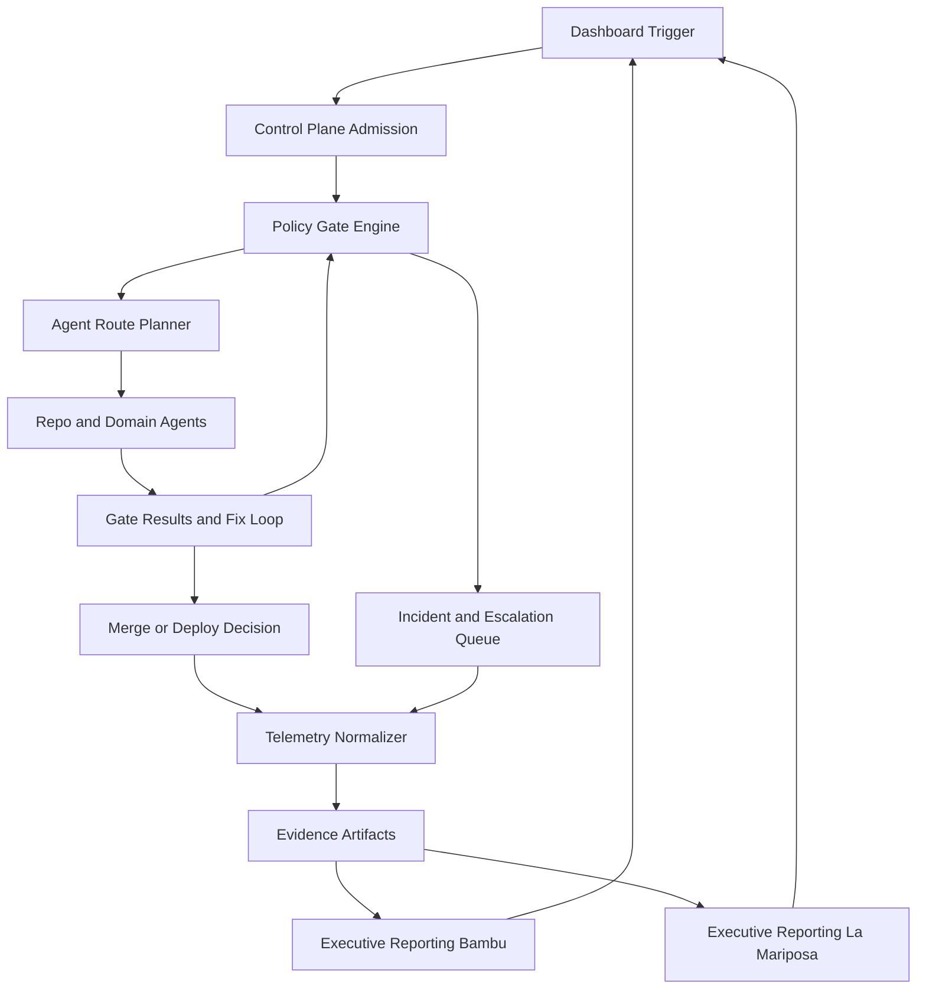

# ARCHONX Dashboard Control Workflows

## 1. Purpose and Source of Truth Scope

This document defines the control-plane operating workflows for `dashboard-agent-swarm` as the orchestration and evidence hub across engineering, compliance, delivery, incidents, growth, and executive reporting.

This planning artifact extends:
- [ARCHONX_AUTONOMOUS_AGENCY_BLUEPRINT.md](plans/ARCHONX_AUTONOMOUS_AGENCY_BLUEPRINT.md)
- [ARCHONX_SOP_AND_PROMPT_SYSTEM.md](plans/ARCHONX_SOP_AND_PROMPT_SYSTEM.md)
- [ARCHONX_HUMAN_LOOP_MINIMIZATION_MAP.md](plans/ARCHONX_HUMAN_LOOP_MINIMIZATION_MAP.md)
- [ARCHONX_REALITY_MAP_AND_GAP_PLAN.md](plans/ARCHONX_REALITY_MAP_AND_GAP_PLAN.md)
- [ARCHONX_SECURE_AUTOMATION_PIPELINE.md](plans/ARCHONX_SECURE_AUTOMATION_PIPELINE.md)
- [AGENTS.md](AGENTS.md)

Control constraints carried forward:
- PAULIWHEEL is mandatory for code-affecting operations
- beads loop PLAN IMPLEMENT TEST EVALUATE PATCH REPEAT is mandatory
- Context7 proof is mandatory before third-party library usage
- ACK gates remain enforceable with restricted fallback mode
- machine-readable evidence is mandatory under `ops/reports/`

Brand normalization where applicable:
- THE PAULI EFFECT™
- Yappyverse™
- La Mariposa

---

## 2. Dashboard Control Plane Operating Model

### 2.1 Control Plane Responsibilities

`dashboard-agent-swarm` acts as:
1. Intake and trigger broker
2. Policy and risk gate evaluator
3. Agent route planner and execution supervisor
4. Evidence and telemetry normalizer
5. Escalation and approval queue manager
6. Executive reporting consolidator for Bambu and La Mariposa streams

### 2.2 Standard Run Envelope

Every dashboard-triggered run must include:

```yaml
control_run:
  run_id: RUN-UUID
  bead_id: BEAD-UUID
  workflow_id: WF-XXXX
  repo_scope:
    - repo-name
  actor:
    type: human|agent
    id: handle-or-agent-id
  risk_tier: low|medium|high|critical
  policy_snapshot:
    ack_required: true
    pauliwheel_required: true
    context7_required_for_third_party: true
  timestamps:
    triggered_at: ISO-8601
```

---

## 3. Workflow Catalog by Operational Domain

## 3.1 WF-REPO-INIT Repo Initiation and Standardization

### Objective
Admit repos into governed control-plane execution with standardized policy and reporting anchors.

### Workflow
1. Dashboard operator starts onboarding run
2. Control plane validates ownership and access
3. Policy package and SOP anchors are validated
4. ACK and bootstrap checks are evaluated
5. Dry-run verification and doctor report are captured
6. Repo status set to admitted or blocked

### UI-to-Backend Contract

| Contract Field | Definition |
|---|---|
| Trigger action | `Start Onboarding` button in dashboard repo registry |
| Required payload | `repo_name`, `repo_url`, `owner_team`, `default_branch`, `run_id`, `bead_id`, `risk_tier`, `requested_by` |
| Policy gates | ACK gate, PAULIWHEEL declared, beads lifecycle hooks present, Agent Lightning bootstrap check, reporting schema validation |
| Expected telemetry event | `control.workflow.repo_init.completed` or `control.workflow.repo_init.blocked` |
| Evidence artifact path | `ops/reports/onboarding-manifest_<run_id>.json`, `ops/reports/governance-checks_<run_id>.json`, `ops/reports/archonx_ops_doctor_<run_id>.json` |

---

## 3.2 WF-POLICY-MONITOR Policy and Compliance Monitoring

### Objective
Continuously enforce governance, ACK health, and drift detection across onboarded repos.

### Workflow
1. Scheduled monitor run starts from dashboard scheduler
2. ACK status and policy conformance are collected
3. Drift checks evaluate branch protection and policy baseline
4. Non-compliant repos auto-shift to restricted state
5. Escalation queue items are opened for unresolved drifts

### UI-to-Backend Contract

| Contract Field | Definition |
|---|---|
| Trigger action | `Run Compliance Sweep` or scheduled cadence trigger |
| Required payload | `scope`, `repo_set`, `policy_version`, `contracts_hash`, `run_id`, `bead_id`, `trigger_mode` |
| Policy gates | ACK compliance, policy package integrity, restricted-mode fallback on failures, redaction policy compliance |
| Expected telemetry event | `control.workflow.policy_monitor.summary` plus per-repo `control.policy.repo_state.changed` |
| Evidence artifact path | `ops/reports/policy_sweep_<run_id>.json`, `ops/reports/ack_status_<run_id>.json`, `ops/reports/restriction_events_<run_id>.json` |

---

## 3.3 WF-PR-GATE-OVERSIGHT PR Gate Status and Auto-Fix Loop Oversight

### Objective
Provide centralized visibility and control for PR gate outcomes and fix-loop convergence.

### Workflow
1. Dashboard ingests PR queue and gate states
2. Failed gates are mapped to deterministic fix tasks
3. Repo agents execute PAULIWHEEL loop with same bead lineage
4. Revalidation runs until pass or stop condition
5. Merge status is set approved blocked or escalated

### UI-to-Backend Contract

| Contract Field | Definition |
|---|---|
| Trigger action | `Evaluate PR Gates` and `Run Auto-Fix` actions |
| Required payload | `pr_id`, `repo`, `branch`, `risk_tier`, `failed_gates`, `run_id`, `bead_id`, `attempt` |
| Policy gates | CI and tests, policy conformance, security scan, Context7 proof gate for dependency touches, artifact completeness |
| Expected telemetry event | `control.workflow.pr_gate.evaluated`, `control.workflow.fix_loop.attempted`, `control.workflow.pr_gate.final_disposition` |
| Evidence artifact path | `ops/reports/gate_eval_<run_id>.json`, `ops/reports/beads_log_<run_id>.jsonl`, `ops/reports/revalidation_<run_id>.json`, `ops/reports/merge_decision_<run_id>.json` |

---

## 3.4 WF-DEPLOY-ORCH Deployment Pipeline Orchestration and Rollback Control

### Objective
Orchestrate progressive deployment lanes with deterministic rollback and post-deploy verification.

### Workflow
1. Dashboard receives approved release bundle
2. Environment policy and secret scope checks execute
3. Progressive deployment lanes run in controlled order
4. Health probes and smoke checks evaluate lane readiness
5. Rollback auto-triggers on threshold breach or command request
6. Closure report records final disposition

### UI-to-Backend Contract

| Contract Field | Definition |
|---|---|
| Trigger action | `Promote Release` and `Invoke Rollback` actions |
| Required payload | `release_id`, `repo`, `environment`, `promotion_lane`, `rollback_recipe_id`, `run_id`, `bead_id`, `risk_tier` |
| Policy gates | release approval matrix, secret scope validation, environment policy parity, rollback recipe required, incident commander gate for critical rollback |
| Expected telemetry event | `control.workflow.deploy.promoted`, `control.workflow.deploy.halted`, `control.workflow.rollback.executed` |
| Evidence artifact path | `ops/reports/deploy_promotion_summary_<run_id>.json`, `ops/reports/post_deploy_checks_<run_id>.json`, `ops/reports/rollback_log_<run_id>.jsonl` |

---

## 3.5 WF-INCIDENT-COMMAND Incident Response Visibility and Escalation

### Objective
Provide real-time incident command visibility with policy-driven escalation and communication governance.

### Workflow
1. Incident signals enter dashboard command queue
2. Severity classification and blast-radius analysis execute
3. Containment playbooks and rollback links are surfaced
4. SEV policy determines mandatory human command triggers
5. Communication drafts and status cadence are tracked
6. Postmortem and corrective backlog are generated

### UI-to-Backend Contract

| Contract Field | Definition |
|---|---|
| Trigger action | `Open Incident`, `Escalate`, `Start Containment`, `Close Incident` |
| Required payload | `incident_id`, `severity`, `affected_repos`, `service_scope`, `incident_commander`, `run_id`, `bead_id`, `trigger_source` |
| Policy gates | severity taxonomy gate, containment guardrails, mandatory human command for SEV1, communication approval gate for external updates |
| Expected telemetry event | `control.workflow.incident.opened`, `control.workflow.incident.escalated`, `control.workflow.incident.closed` |
| Evidence artifact path | `ops/reports/incident_timeline_<run_id>.json`, `ops/reports/escalation_<run_id>.json`, `ops/reports/postmortem_<run_id>.md` |

---

## 3.6 WF-GROWTH-OPS Lead-Gen and Content Operations Tracking

### Objective
Track growth pipeline execution with policy-safe content generation, attribution, and lead routing visibility.

### Workflow
1. Campaign brief enters dashboard growth queue
2. Brand and claims policy checks are validated
3. Content drafts and channel packages are generated
4. Publish schedule is orchestrated with approval dependencies
5. Leads are scored and routed to execution lanes
6. Weekly optimization recommendations are published

### UI-to-Backend Contract

| Contract Field | Definition |
|---|---|
| Trigger action | `Create Campaign Run`, `Approve Publish`, `Execute Routing` |
| Required payload | `campaign_id`, `brand_stream`, `channels`, `offer_type`, `lead_routing_profile`, `run_id`, `bead_id`, `requested_by` |
| Policy gates | brand lexicon checks, claims and legal filters, attribution completeness, anti-spam and data quality checks |
| Expected telemetry event | `control.workflow.growth.campaign_started`, `control.workflow.growth.publish_status`, `control.workflow.growth.lead_routing_summary` |
| Evidence artifact path | `ops/reports/growth_campaign_<run_id>.json`, `ops/reports/content_policy_<run_id>.json`, `ops/reports/lead_routing_<run_id>.json` |

---

## 3.7 WF-EXEC-REPORT Executive Reporting for Bambu and La Mariposa

### Objective
Deliver decision-grade executive summaries across operational, risk, growth, and incident domains.

### Workflow
1. Dashboard aggregates source-of-truth artifacts across workflows
2. KPI packs are normalized by executive stream
3. Risk and exception digest is generated
4. Action-oriented brief is assembled for leadership review
5. Distribution and acknowledgment status are tracked

### UI-to-Backend Contract

| Contract Field | Definition |
|---|---|
| Trigger action | `Generate Executive Brief` and scheduled executive cadence |
| Required payload | `reporting_window`, `stream`, `audience`, `kpi_set`, `run_id`, `bead_id`, `include_incidents`, `include_growth` |
| Policy gates | source-link integrity gate, redaction policy, executive template schema validation, sensitive-content filter |
| Expected telemetry event | `control.workflow.exec_report.generated` and `control.workflow.exec_report.distributed` |
| Evidence artifact path | `ops/reports/executive_bambu_<run_id>.md`, `ops/reports/executive_la_mariposa_<run_id>.md`, `ops/reports/executive_metrics_<run_id>.json` |

---

## 4. Role-Based Control Views

## 4.1 Operator Persona Views

| Persona | Primary Views | Allowed Actions | Restricted Actions | Escalation Responsibility |
|---|---|---|---|---|
| Principal Architect | global policy view, multi-repo risk map, major exception queue | approve policy changes, approve high-risk gates, authorize architecture exceptions | none beyond legal-only boundaries | final arbitration for governance conflicts |
| Operations Supervisor | run queue board, compliance monitor, deploy lane status | trigger sweeps, requeue jobs, approve medium-risk operations per policy | cannot bypass critical approval gates | escalates unresolved blockers to Principal Architect |
| Incident Commander | incident war room, blast-radius map, rollback controls | declare severity, authorize containment, authorize critical rollback, close incident | cannot alter policy baselines during active incident | owns SEV1 command decisions |
| Growth Operations Lead | campaign board, lead quality dashboard, attribution health view | approve channel publish, trigger lead routing, request optimization loops | cannot publish blocked legal-sensitive content | escalates legal-sensitive content for approval |
| Executive Viewer Bambu | Bambu stream executive board | view status and approved decisions | no control actions | strategic review only |
| Executive Viewer La Mariposa | La Mariposa stream executive board | view status and approved decisions | no control actions | strategic review only |

## 4.2 Agent Persona Views

| Agent Persona | Primary Views | Allowed Actions | Hard Guards |
|---|---|---|---|
| Control Plane Governor | policy state dashboard, ACK health matrix | enforce restricted mode, block runs, emit governance events | cannot approve disallowed actions |
| Orchestration Coordinator | dependency DAG, queue orchestration panel | route tasks, sequence multi-repo runs, open escalation tickets | must respect risk-tier approval matrix |
| Repo Execution Crew | PR and fix-loop execution board | run beads lifecycle, patch, test, publish evidence artifacts | cannot merge if gate set incomplete |
| Security Guardian | vulnerability and secret policy panel | classify findings, block unsafe actions, require human review on critical | cannot downgrade critical severity without policy path |
| Reporting and Evidence Agent | telemetry ingestion and report compiler | generate normalized reports and executive packs | cannot publish unsourced metrics |
| Growth Content Operator | campaign generation and routing panel | create drafts, package channel outputs, route leads by policy | cannot bypass claims and legal filters |

---

## 5. Workflow Orchestration Diagram



---

## 6. Implementation Handoff Checklist for Code Mode

### 6.1 Build Checklist

- [ ] Implement workflow registry endpoint with workflow ids and contract fields
- [ ] Implement trigger handlers for all seven workflow domains
- [ ] Implement policy gate middleware for ACK, PAULIWHEEL, beads evidence, Context7 proof
- [ ] Implement telemetry emitter using canonical integration schema
- [ ] Implement artifact writer for deterministic `ops/reports` paths
- [ ] Implement role-based views and permission guards for operator and agent personas
- [ ] Implement escalation queue with severity policy and approval paths
- [ ] Implement executive report compiler for Bambu and La Mariposa streams

### 6.2 Acceptance Criteria

1. Every dashboard action maps to one workflow id and emits one terminal disposition
2. Every workflow execution records required payload validation and policy gate results
3. Every workflow emits expected telemetry events using protocol `agent-fleet-v1`
4. Every workflow writes evidence artifacts at documented paths under `ops/reports/`
5. Missing ACK or missing mandatory policy proof forces fail-closed behavior
6. PR gate and fix-loop workflow shows full bead lineage and attempt history
7. Deploy workflow supports explicit rollback invocation with auditable logs
8. Incident workflow enforces SEV1 human command path before closure
9. Growth workflow enforces brand and claims checks before publish
10. Executive reporting produces separate Bambu and La Mariposa briefs linked to source artifacts

### 6.3 Verification Outputs Required

- `ops/reports/control_workflow_contract_validation_<run_id>.json`
- `ops/reports/control_workflow_telemetry_audit_<run_id>.json`
- `ops/reports/control_workflow_artifact_index_<run_id>.json`
- `ops/reports/control_workflow_rbac_audit_<run_id>.json`

---

## 7. Non-Goals and Constraints

- This document does not implement runtime code
- This document does not override legal authority or compliance authority
- This document remains markdown planning only and acts as control-plane source-of-truth for downstream code mode implementation
