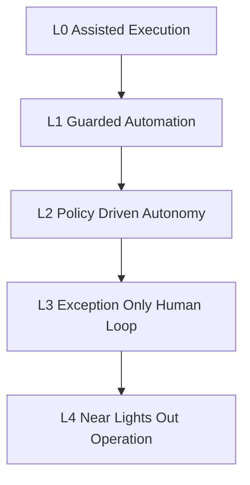

# ARCHONX Human Loop Minimization Map

## 1. Purpose and Position in Planning Stack

This map extends [`ARCHONX_AUTONOMOUS_AGENCY_BLUEPRINT.md`](plans/ARCHONX_AUTONOMOUS_AGENCY_BLUEPRINT.md) and [`ARCHONX_SOP_AND_PROMPT_SYSTEM.md`](plans/ARCHONX_SOP_AND_PROMPT_SYSTEM.md) into an execution-focused decision model for reducing human effort while preserving governance, safety, and auditability.

Target operating condition:
- Human involvement constrained to strategic direction, high-risk approvals, and incident command
- Daily human load below three hours with no policy bypasses
- Deterministic evidence generation through `archonx-ops doctor` and SOP artifacts

---

## 2. Decision Matrix Model

### 2.1 Scoring Definitions

- Human dependency level
  - H3 = human decision required now
  - H2 = human review required with agent preparation
  - H1 = human exception-only
  - H0 = no routine human touch
- Automation readiness state
  - R0 = not instrumented
  - R1 = instrumented but unstable
  - R2 = stable under guardrails
  - R3 = autonomous candidate

### 2.2 Required Matrix Fields

Each operation is defined by:
1. Current human dependency
2. Replacement candidate agent or tool in current ArchonX ecosystem
3. Safeguards and policy gates
4. Readiness criteria to automate
5. Residual mandatory human checkpoints

---

## 3. Full Cross-Domain Decision Matrix

## 3.1 Repo Governance

| Operation | Current human dependency | Replacement candidate agent or tool | Required safeguards and policy gates | Measurable readiness criteria to automate | Residual mandatory human checkpoints |
|---|---|---|---|---|---|
| Repo onboarding admission `SOP-ONBOARD` | H3 | Control Plane Governor plus Orchestration Coordinator | ACK gate green, policy package injection, reporting contract validation, `archonx-ops doctor` dry run | 100 percent onboarding runs emit valid onboarding-manifest and governance-checks artifacts, zero missing ACK events for latest cycle | Final admission sign-off for first run per repo family |
| Branch protection and governance baseline drift detection | H2 | Reporting and Evidence Agent plus dashboard-agent-swarm policy watcher | Drift policy contract, restricted mode on non-compliance, machine-readable drift report | Drift detection precision above agreed threshold, false positive rate below governance tolerance, auto-remediation success sustained | Human arbitration only for conflicting policy exceptions |
| Agent ACK compliance monitoring | H2 | Control Plane Governor | Scheduled sync verification, restricted status enforcement, audit log immutability | Three consecutive sync windows with full ACK capture and deterministic restriction on non-ACK agents | Human override only for emergency continuity declaration |
| SOP version rollout and compatibility checks | H3 | Orchestration Coordinator plus Architect prompt pack runner | Semver gate, migration notes required, ACK refresh required for breaking changes | All impacted repos complete compatibility checklists, no silent edits detected, changelog completeness 100 percent | Major version approval by Human Principal Architect |
| Brand normalization enforcement in templates and outputs | H2 | Reviewer prompt pack plus Growth Content Operator | Lexicon policy checks for THE PAULI EFFECT™, Yappyverse™, La Mariposa where applicable | Automated lexical compliance across sampled artifacts reaches stable pass rate, exception queue low and explainable | Human review for legal naming disputes or client exemption requests |

## 3.2 Coding and PR Lifecycle

| Operation | Current human dependency | Replacement candidate agent or tool | Required safeguards and policy gates | Measurable readiness criteria to automate | Residual mandatory human checkpoints |
|---|---|---|---|---|---|
| Intake triage and bead id assignment `SOP-DEVREV` | H2 | Orchestration Coordinator | Mandatory bead id, risk tier tagging, scope contract validation | All incoming tasks receive bead id and risk tier without orphan runs, SLA breach count near zero | Human intervention only for ambiguous objective or legal ambiguity |
| PLAN IMPLEMENT TEST EVALUATE PATCH REPEAT execution | H2 | Repo Execution Crew agents | PAULIWHEEL enforcement, beads log evidence, blocked on missing loop stage | Complete loop evidence in beads-log for all code-affecting runs, stage skip rate zero | Human checkpoint only on repeated fail loops above policy threshold |
| Third-party dependency usage compliance | H3 | Context7 Guard extension and Reviewer agent | Mandatory resolve-library-id then docs retrieval before code use, merge blocked on missing proof | Proof artifact present for every new third-party touch, policy violation count trending to zero | Human security review for high-risk dependency introduction |
| PR artifact generation and quality summary | H2 | Repo Execution Crew plus Reporting Agent | PR template contract, test-summary and policy-results required | PRs open with complete artifact pack and no missing required fields | Human review only for high and critical risk tiers |
| Merge gate decision `SOP-PRGATE` | H3 | Reviewer prompt pack plus Security Guardian | Risk-tier gate matrix, quality gates, security scan, rollback recipe gate | Low-risk merge auto-approval pass rate stable with no post-merge incident linkage | Human approver required for high and critical tiers, and policy-triggered medium |
| Cross-repo dependency conflict handling | H3 | Orchestration Coordinator with dashboard DAG planner | Dependency ordering gate, deadlock detection, escalation contract | Conflict auto-resolution success and deterministic sequencing across multi-repo bundles | Human arbitration for unresolved deadlock or contradictory business priorities |

## 3.3 Deployments

| Operation | Current human dependency | Replacement candidate agent or tool | Required safeguards and policy gates | Measurable readiness criteria to automate | Residual mandatory human checkpoints |
|---|---|---|---|---|---|
| Release candidate assembly `SOP-RELEASE` | H2 | Repo Execution Crew plus Release Orchestrator | Approved PR bundle only, release manifest required, environment policy checks | Release manifest completeness 100 percent, rejected bundle rate due to metadata gap near zero | Human sign-off only for critical environment promotions |
| Pre-deploy validation and secret integrity checks | H3 | Security Guardian plus Control Plane policy engine | Secret presence and scope checks, environment policy gate, deny on unresolved findings | Validation pass stability, zero secret-scope violations in recent windows | Human checkpoint for production secret rotation or emergency key events |
| Deployment execution | H2 | Deployment automation toolchain via control plane | Health probe baseline, smoke tests, deployment log contract | Successful automated deploy ratio sustained with low rollback trigger frequency | Human approval for critical tier prod deploys until R3 maturity |
| Rollback invocation | H2 | Incident-aware Release Orchestrator | Deterministic rollback recipe, trigger condition policy, rollback-log emission | Rollback drills pass consistently, mean recovery within policy target | Human incident commander authority for SEV1 rollback confirmation |
| Post-deploy verification and closure | H2 | Reporting and Evidence Agent | Post-deploy checks required, doctor report publication | Post-deploy checks complete for all releases, unresolved regressions auto-create corrective backlog | Human closure only for critical business KPI anomaly |

## 3.4 Security and Incident Handling

| Operation | Current human dependency | Replacement candidate agent or tool | Required safeguards and policy gates | Measurable readiness criteria to automate | Residual mandatory human checkpoints |
|---|---|---|---|---|---|
| Security scan triage and severity classification | H3 | Security Guardian | Severity rubric, false-positive suppression policy, immutable finding log | Classification consistency across repeated samples, low human reclassification rate | Human validation for critical findings and compliance-sensitive domains |
| Vulnerability remediation routing | H2 | Task Delegator plus Repo Execution Crew | Risk-tier mapping, fix SLA policy, blocked release on unresolved critical | Routing accuracy and closure reliability sustained, breach count reduced | Human override for customer-impact tradeoff decisions |
| Incident alert intake and SEV routing `SOP-INCIDENT` | H3 | Incident Orchestrator within dashboard-agent-swarm | Severity policy, containment playbook gate, comms logging required | Correct SEV assignment stability, escalation latency within policy bounds | Human command mandatory for SEV1 |
| Containment and mitigation actions | H2 | Incident response agents plus deploy rollback automation | Guarded playbooks, blast-radius limits, action audit log | Containment success without policy violation across drills and real events | Human command retained for cross-tenant or legal-impact incidents |
| Stakeholder communication drafting | H2 | Reporting Agent plus Growth Content Operator | Approved comms templates, legal phrase guardrails, provenance links | Draft acceptance rate high with low rewrite overhead, timeline logging complete | Human approval before external customer broadcast for SEV1 and SEV2 |
| Postmortem generation and corrective backlog | H2 | Reporting Agent plus Architect pack | Timeline completeness gate, corrective-action schema, ownership assignment required | Postmortems published on schedule with actionable remediation items and tracked closure | Human review for systemic policy failures or recurring incident class |

## 3.5 Content and Lead-Gen Workflows

| Operation | Current human dependency | Replacement candidate agent or tool | Required safeguards and policy gates | Measurable readiness criteria to automate | Residual mandatory human checkpoints |
|---|---|---|---|---|---|
| Campaign brief synthesis from business goals `SOP-GROWTH` | H2 | Growth Content Operator | Brand policy checks, objective and channel schema validation | Brief acceptance quality stable, missing field rate near zero | Human checkpoint for strategic campaign pivots |
| Content draft generation per channel | H2 | Growth Content Operator with prompt pack variants | Brand lexicon enforcement, claims policy, prohibited language filters | Drafts pass policy gates with low manual rework rate | Human review for regulated claims or sensitive offers |
| Asset provenance and attribution tracking | H3 | Reporting and Evidence Agent | Provenance metadata required, legal attribution gate | Attribution completeness reaches consistent full coverage | Human legal review for disputed ownership |
| Publish scheduling and channel execution | H2 | Orchestration Coordinator plus growth automation runner | Channel checklist gate, approval dependency checks | Publish workflow executes without skipped checklist gates | Human checkpoint for first launch in new channel |
| Lead quality scoring and routing | H2 | Dashboard analytics plus Task Delegator | Data quality gates, anti-spam policy, routing contract | Lead quality precision stable, misroute rate below threshold | Human spot-check for high-value account leads |
| Weekly optimization loop | H1 | Growth Content Operator plus Reporting Agent | KPI telemetry integrity checks, recommendation confidence gate | Optimization proposals consistently tied to measurable KPI movement | Human approval for budget-impacting strategy changes |

## 3.6 Client Communications and Approvals

| Operation | Current human dependency | Replacement candidate agent or tool | Required safeguards and policy gates | Measurable readiness criteria to automate | Residual mandatory human checkpoints |
|---|---|---|---|---|---|
| Status digest generation | H2 | Reporting and Evidence Agent | Source-of-truth artifact linking, redaction policy, accuracy checks | Digest factual error rate minimal and trend-stable | Human spot audit on fixed cadence |
| Milestone readiness packet assembly | H2 | Orchestration Coordinator plus Reporting Agent | Evidence completeness gate, risk register attachment, rollback readiness included | Packet acceptance rate high with no missing mandatory attachments | Human approval for contract-bound milestones |
| Change request interpretation and impact draft | H3 | Architect prompt pack plus DAG analyzer | Scope boundary checks, dependency impact graph, risk-tier recalculation | Draft accuracy validated by low correction rate in sample reviews | Human final decision on scope and budget boundary |
| Approval request routing and reminders | H1 | Dashboard-agent-swarm workflow engine | SLA timers, escalation tree policy, immutable decision log | Routing latency low, missed approvals minimized | Human action only to approve or reject gated actions |
| Executive brief for La Mariposa stream | H2 | Reporting Agent with executive template | Sensitive-content filter, concise decision framing, policy exception highlights | Brief utility score stable from stakeholder feedback proxy | Human strategic direction and exception arbitration remains mandatory |
| Client-facing incident update cadence | H2 | Incident Orchestrator plus comms drafter | Frequency policy, legal approved template, timestamped disclosure logs | On-time updates sustained during incidents, low correction after review | Human approval for high-impact external statements |

---

## 4. Phased Autonomy Ladder

## 4.1 Ladder Overview

## 4.2 Phase Definitions and Human Load Profile

| Level | Operating posture | Human load profile | Automation boundary | Hard risk controls |
|---|---|---|---|---|
| L0 Assisted Execution | Agents prepare, humans decide most gates | Above target | Drafting and evidence automation only | Full manual merge and deploy approvals |
| L1 Guarded Automation | Low-risk paths automated, medium-plus gated | Reduced but above target | Auto-run for low-risk SOP paths | ACK gates, Context7 proof, quality gates mandatory |
| L2 Policy Driven Autonomy | Medium-risk partially automated under strict policy triggers | Near target | Auto triage, auto PR packaging, auto deploy to non-critical tiers | Security veto, rollback readiness, immutable audit trails |
| L3 Exception Only Human Loop | Humans intervene on policy triggers, critical risk, incidents | At target below three hours daily | Default autonomous for governance compliant flows | SEV1 human command, major SOP change approval, legal gate |
| L4 Near Lights Out Operation | Human role is strategic governance and rare arbitration | Sustained below target | End-to-end autonomous for pre-approved classes | Global kill switch, emergency restriction mode, quarterly governance review |

## 4.3 Advancement Gate Criteria

Advance only when all are true:
- Gate pass reliability stable across representative run volumes
- Incident rate and rollback quality within policy tolerance
- Audit reconstruction complete from intake to disposition
- No unresolved critical policy violations in current evaluation window
- Human override events are low, explainable, and codified into updated policy

---

## 5. No-Human Candidates vs Human-Required Operations

## 5.1 No-Human Candidate List

These can move to H0 when readiness reaches R3 and safeguards are active:
1. Bead id assignment and run manifest generation
2. Routine policy conformance checks and ACK status polling
3. Low-risk PR packaging with artifact completeness validation
4. Non-critical environment deployment execution with auto smoke checks
5. Status digest drafting from machine-readable artifacts
6. Lead scoring and routing under validated model thresholds
7. Weekly optimization recommendation generation for growth operations

Rationale:
- Deterministic inputs and outputs
- Strong policy gateability
- High observability with auditable artifacts
- Low irreversible risk when rollback or requeue exists

## 5.2 Human-Required List

These remain mandatory human checkpoints regardless of automation maturity:
1. Major governance contract changes and SOP major version approvals
2. High and critical risk merge approvals where policy requires human sign-off
3. SEV1 incident command and cross-tenant blast radius decisions
4. Legal or compliance-sensitive external communications
5. Strategic scope, contract, or budget boundary changes with clients
6. Emergency global halt and recovery authorization

Rationale:
- Non-delegable accountability and legal exposure
- High-impact risk concentration
- Strategic tradeoff decisions that exceed deterministic policy logic

---

## 6. Safeguard Stack Reference

Every autonomy increase must keep this stack active:
1. Admission controls: ACK gate, policy package integrity, role permission checks
2. Execution controls: PAULIWHEEL enforcement, mandatory beads lifecycle evidence
3. Dependency controls: Context7 pre-usage verification before third-party library adoption
4. Merge and release controls: risk-tier matrix, security veto, rollback recipe requirement
5. Incident controls: severity routing, comms protocol, command authority model
6. Evidence controls: machine-readable reports under `ops/reports/`, immutable decision logs
7. Failsafe controls: restricted mode, kill switch, forced human escalation on unknown-risk state

---

## 7. Handoff Pointers for Follow-Up Implementation Teams

## 7.1 Control Plane Implementation Team

- Implement operation-level automation state fields in governance registry: `human_dependency`, `readiness_state`, `last_gate_result`
- Add dashboard views for H-level and R-level by domain and repo
- Enforce automatic downgrade to restricted mode on missing critical artifacts

## 7.2 Repo Delivery Team

- Add mandatory artifact validation in PR pipelines for beads log, policy results, and Context7 proof
- Implement risk-tier aware merge policy automation for low-risk only first
- Wire fallback path that creates escalation tickets with full evidence bundle

## 7.3 Platform Reliability Team

- Operationalize release guardrails in `SOP-RELEASE` with deterministic rollback drills
- Add post-deploy verification contracts and automatic incident trigger thresholds
- Publish release and rollback reliability metrics to control plane

## 7.4 Security and Incident Team

- Codify severity taxonomy and mandatory human-command triggers in incident engine
- Calibrate security finding classification to reduce false positives without missing criticals
- Standardize incident comms templates and approval routing for external statements

## 7.5 Growth Ops and Client Success Team

- Integrate brand and claims policy checks into campaign generation workflows
- Automate content provenance capture and approval traceability
- Establish client-facing approval packet templates tied to SOP artifacts

## 7.6 Program Governance Team

- Define promotion criteria from L0 to L4 as policy objects, not ad hoc decisions
- Run periodic autonomy audits against this matrix and publish variance reports
- Maintain exception catalog and convert recurring exceptions into explicit policy rules

---

## 8. Implementation Sequencing Contract

Use this order for downstream execution planning:
1. Instrumentation first: artifact completeness and policy observability
2. Low-risk automation first: H2 to H1 and H1 to H0 candidates
3. Risk-gated expansion: medium-risk paths under strict rollback and veto controls
4. Exception hardening: convert recurring human interventions into policy updates
5. Continuous governance: maintain auditable control of autonomy boundary changes

This sequencing is mandatory to reach sub-three-hour human load without eroding control quality.

---

## 9. Acceptance Criteria for This Map

This minimization map is implementation-ready when:
- All required domains and operations are covered in the matrix
- Each operation includes the five required fields
- Autonomy ladder includes clear progression and risk controls
- No-human and human-required lists are explicit with rationale
- Handoff pointers map directly to follow-up implementation teams
- Scope remains markdown-only planning aligned with ArchonX governance artifacts

This document is planning-only and introduces no non-markdown changes.
