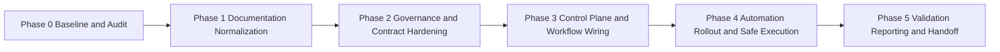

# ARCHONX Phased Implementation Roadmap

## Objective

This roadmap operationalizes the planning stack into execution phases with compliance checkpoints, reporting cadence, and implementation handoff gates.

Depends on:
- [`ARCHONX_AUTONOMOUS_AGENCY_BLUEPRINT.md`](plans/ARCHONX_AUTONOMOUS_AGENCY_BLUEPRINT.md)
- [`ARCHONX_SOP_AND_PROMPT_SYSTEM.md`](plans/ARCHONX_SOP_AND_PROMPT_SYSTEM.md)
- [`ARCHONX_HUMAN_LOOP_MINIMIZATION_MAP.md`](plans/ARCHONX_HUMAN_LOOP_MINIMIZATION_MAP.md)
- [`ARCHONX_REALITY_MAP_AND_GAP_PLAN.md`](plans/ARCHONX_REALITY_MAP_AND_GAP_PLAN.md)
- [`ARCHONX_SECURE_AUTOMATION_PIPELINE.md`](plans/ARCHONX_SECURE_AUTOMATION_PIPELINE.md)
- [`ARCHONX_DASHBOARD_CONTROL_WORKFLOWS.md`](plans/ARCHONX_DASHBOARD_CONTROL_WORKFLOWS.md)
- [`ARCHONX_SPEC_DRIVEN_DOC_PATCH_AND_EXECUTION_PRD.md`](plans/ARCHONX_SPEC_DRIVEN_DOC_PATCH_AND_EXECUTION_PRD.md)

## Phase Model

## Phase 0 Baseline and Audit

Scope:
- inventory all `plans` artifacts
- verify cross references and unresolved placeholders
- confirm control alignment against [`AGENTS.md`](AGENTS.md)

Checkpoint:
- baseline report exists under `ops/reports/doc_baseline.json`

Exit criteria:
- full file inventory published
- identified conformance issues enumerated

## Phase 1 Documentation Normalization

Scope:
- enforce section spec defined in [`ARCHONX_SPEC_DRIVEN_DOC_PATCH_AND_EXECUTION_PRD.md`](plans/ARCHONX_SPEC_DRIVEN_DOC_PATCH_AND_EXECUTION_PRD.md)
- normalize headings, terminology, and artifact references

Checkpoint:
- conformance report under `ops/reports/doc_conformance_phase1.json`

Exit criteria:
- each in-scope file includes required section order
- no unresolved TODO or placeholder sections

## Phase 2 Governance and Contract Hardening

Scope:
- add explicit workflow contracts: trigger, payload, policy gate, telemetry event, evidence path
- map each workflow to compliance controls and escalation routes

Checkpoint:
- contract completeness report under `ops/reports/doc_contracts_phase2.json`

Exit criteria:
- all workflows have deterministic contracts
- PAULIWHEEL and compliance mapping present

## Phase 3 Control Plane and Workflow Wiring

Scope:
- bind dashboard views, operator roles, and agent roles to workflow actions
- define executable handoff packets for code mode

Checkpoint:
- control workflow mapping report under `ops/reports/dashboard_workflow_phase3.json`

Exit criteria:
- each dashboard action has backend contract and evidence sink
- role restrictions and escalation boundaries documented

## Phase 4 Automation Rollout and Safe Execution

Scope:
- sequence implementation tasks from docs into code-mode-ready packets
- define rollback controls and failure pathways per packet

Checkpoint:
- rollout plan under `ops/reports/automation_rollout_phase4.json`

Exit criteria:
- implementation packets include acceptance criteria and rollback notes
- all packets have owner and dependency declarations

## Phase 5 Validation Reporting and Handoff

Scope:
- consolidate all evidence outputs
- produce final execution matrix and patch ledger
- publish implementation handoff brief

Checkpoint:
- final readiness report under `ops/reports/doc_readiness_phase5.json`

Exit criteria:
- execution matrix and patch ledger published
- all planning docs marked implementation-ready

## Compliance Checkpoints

At end of each phase, MUST verify:
- governance alignment to [`AGENTS.md`](AGENTS.md)
- evidence path existence for each claimed control
- no contract ambiguity in trigger or payload requirements

## Reporting Cadence

Required artifacts per phase:
- machine-readable phase status report under `ops/reports`
- markdown summary in corresponding `plans` document where relevant
- consolidated readiness status updated in roadmap change log section

## Handoff to Code Mode

Code mode receives:
- this roadmap
- execution matrix
- patch ledger
- final task packet list with acceptance criteria and evidence obligations

No code implementation should start until Phase 5 exit criteria is satisfied.
