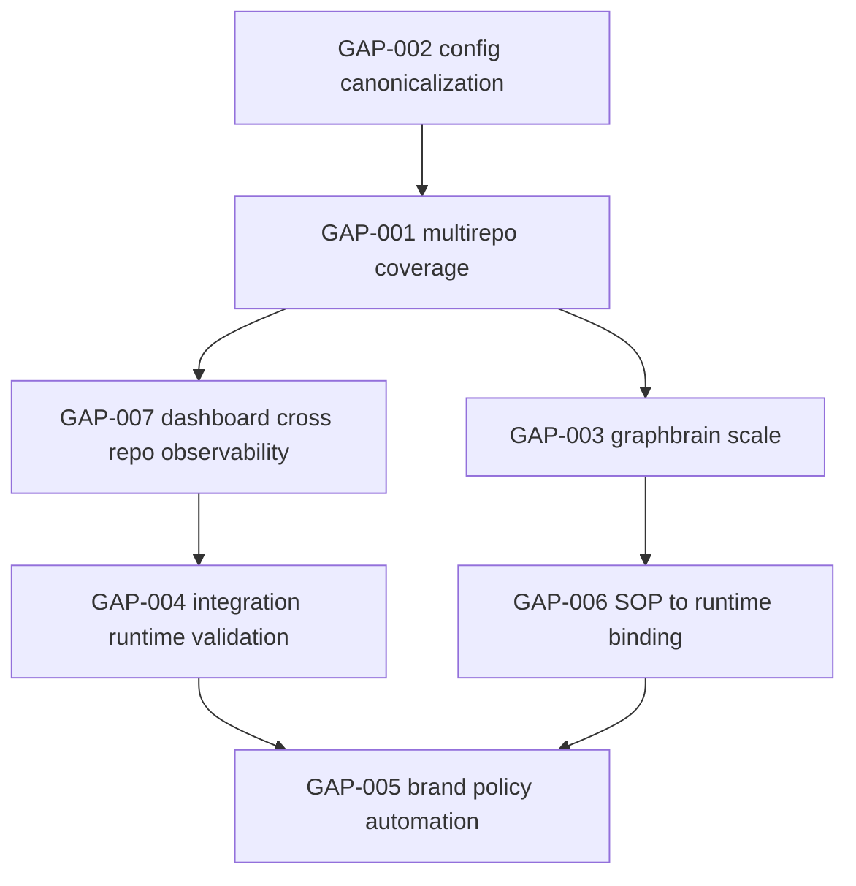

# ARCHONX Reality Map and Gap Plan

## 1. Purpose and Scope

This artifact establishes the current ecosystem baseline using only workspace-verifiable evidence and defines the implementation handoff gap plan for the next execution phases under ArchonX governance.

This plan is constrained to:
- observed state in this workspace only
- planning-grade gap definitions with evidence paths
- no assumptions presented as facts

Planning alignment sources:
- [ARCHONX_AUTONOMOUS_AGENCY_BLUEPRINT.md](plans/ARCHONX_AUTONOMOUS_AGENCY_BLUEPRINT.md)
- [ARCHONX_SOP_AND_PROMPT_SYSTEM.md](plans/ARCHONX_SOP_AND_PROMPT_SYSTEM.md)
- [ARCHONX_HUMAN_LOOP_MINIMIZATION_MAP.md](plans/ARCHONX_HUMAN_LOOP_MINIMIZATION_MAP.md)

---

## 2. Evidence Baseline Method

Evidence baseline was built from:
- repository governance and operating rules in [AGENTS.md](AGENTS.md)
- system and structure references in [README.md](README.md), [STRUCTURE.md](STRUCTURE.md), and [core/README.md](core/README.md)
- ops runner and report contracts in [ops/runner/README.md](ops/runner/README.md)
- compliance and health reports in [ops/reports](ops/reports)
- graph intelligence artifacts in [ops/reports/graphbrain](ops/reports/graphbrain)
- integration registry metadata in [dashboard-agent-swarm/integrations/README.md](dashboard-agent-swarm/integrations/README.md)

---

## 3. Ecosystem Reality Map

## 3.1 Repo Groups and Known Assets

| Group | Workspace Evidence | Known Assets | Current Reality Signal |
|---|---|---|---|
| Control plane and governance | [AGENTS.md](AGENTS.md), [ops/runner/README.md](ops/runner/README.md), [ops/scheduler](ops/scheduler), [ops/cron](ops/cron) | PAULIWHEEL default, ACK gates, `archonx-ops` entrypoints, scheduled sync artifacts | Governance model exists and is codified; enforcement across full external ecosystem is partially evidenced |
| Core runtime and agent kernel | [README.md](README.md), [archonx](archonx), [core](core), [core/agents](core/agents) | 64-agent framing, dual-crew model, core agent modules, FastAPI runtime references | Core platform structure exists; operational status should be validated in code/debug runs |
| Dashboard and orchestration UI | [dashboard-agent-swarm](dashboard-agent-swarm), [dashboard-agent-swarm/integrations](dashboard-agent-swarm/integrations) | Integration contracts, telemetry schema references, deployment docs, UI components | Dashboard assets are present; cross-repo live governance coverage not yet evidenced here |
| Graph intelligence layer | [core/graphbrain](core/graphbrain), [ops/runner/archonx_graphbrain_runner.py](ops/runner/archonx_graphbrain_runner.py), [ops/reports/graphbrain](ops/reports/graphbrain) | Graph snapshot generation, audit scaffolding, recommendation/evidence packs | Graphbrain is bootstrapped but currently limited to low indexed coverage |
| Operational reporting and doctor outputs | [ops/reports](ops/reports) | `doctor`, PAULIWHEEL sync report, compliance matrix, meeting and eco reports | Reporting pipeline exists and emits machine-readable outputs |
| Extended ecosystem declarations | [ops/reports/PAULIWHEEL_SYNC_REPORT_20260219T063904Z.json](ops/reports/PAULIWHEEL_SYNC_REPORT_20260219T063904Z.json), [ops/reports/PAULIWHEEL_COMPLIANCE_MATRIX_20260219T063904Z.json](ops/reports/PAULIWHEEL_COMPLIANCE_MATRIX_20260219T063904Z.json) | Declared repos for executiveusa org ecosystem | Most declared repos are in partial state due to missing local checkout evidence |

## 3.2 Existing Governance Artifacts

| Governance Domain | Evidence Path | Observed State |
|---|---|---|
| Agent behavioral standard | [AGENTS.md](AGENTS.md) | PAULIWHEEL default and beads loop are explicitly mandatory |
| Third-party dependency policy | [AGENTS.md](AGENTS.md) | Context7 resolve plus docs retrieval is mandatory before third-party code usage |
| Compliance gating | [AGENTS.md](AGENTS.md) | ACK non-compliance leads to restricted status |
| Operational cadence | [AGENTS.md](AGENTS.md) | Sync frequency and doctor reporting cadence are defined |
| SOP and prompt contract layer | [ARCHONX_SOP_AND_PROMPT_SYSTEM.md](plans/ARCHONX_SOP_AND_PROMPT_SYSTEM.md) | Canonical SOP registry and prompt envelope structures are planning-complete |
| Human loop minimization controls | [ARCHONX_HUMAN_LOOP_MINIMIZATION_MAP.md](plans/ARCHONX_HUMAN_LOOP_MINIMIZATION_MAP.md) | H and R maturity framework plus safeguards are planning-complete |

## 3.3 Existing Contracts, Reports, Dashboards, and Graphbrain Data

| Category | Evidence Path | Current State Summary |
|---|---|---|
| Ops doctor health report | [ops/reports/doctor_20260224_044031.json](ops/reports/doctor_20260224_044031.json) | Overall healthy; warns config duplication and mismatch |
| PAULIWHEEL sync report | [ops/reports/PAULIWHEEL_SYNC_REPORT_20260219T063904Z.json](ops/reports/PAULIWHEEL_SYNC_REPORT_20260219T063904Z.json) | Repos scanned with partial status and explicit blocking issue for missing local checkouts |
| Compliance matrix | [ops/reports/PAULIWHEEL_COMPLIANCE_MATRIX_20260219T063904Z.json](ops/reports/PAULIWHEEL_COMPLIANCE_MATRIX_20260219T063904Z.json) | Ecosystem compliance visibility exists but partial confidence |
| Meeting and eco artifacts | [ops/reports/pauliwheel_meeting_20260219T063904Z.json](ops/reports/pauliwheel_meeting_20260219T063904Z.json), [ops/reports/FINAL_ECO_PROMPT_REPORT.json](ops/reports/FINAL_ECO_PROMPT_REPORT.json) | Meeting-level reporting contract exists |
| Graph snapshot and evidence pack | [ops/reports/graphbrain/GRAPH_SNAPSHOT_20260219T090135Z.json](ops/reports/graphbrain/GRAPH_SNAPSHOT_20260219T090135Z.json), [ops/reports/graphbrain/EVIDENCE_PACK_20260219T090135Z.json](ops/reports/graphbrain/EVIDENCE_PACK_20260219T090135Z.json) | Graph built with limited repo indexing and bootstrap bead |
| Dashboard integration contracts | [dashboard-agent-swarm/integrations/external-tools-contract.md](dashboard-agent-swarm/integrations/external-tools-contract.md), [dashboard-agent-swarm/integrations/external-tools-security-policy.md](dashboard-agent-swarm/integrations/external-tools-security-policy.md), [dashboard-agent-swarm/integrations/external-tools-telemetry-schema.md](dashboard-agent-swarm/integrations/external-tools-telemetry-schema.md) | Baseline integration contract set exists |

## 3.4 Known Integration Surfaces and Current Gaps

| Integration Surface | Evidence Path | Current State | Gap Signal |
|---|---|---|---|
| Multi-repo compliance orchestration | [ops/runner/archonx_ops_runner.py](ops/runner/archonx_ops_runner.py), [ops/reports/PAULIWHEEL_SYNC_REPORT_20260219T063904Z.json](ops/reports/PAULIWHEEL_SYNC_REPORT_20260219T063904Z.json) | Workflow exists and emits reports | Declared repos not fully mounted locally; partial compliance state |
| Graph intelligence feedback loop | [core/graphbrain](core/graphbrain), [ops/reports/graphbrain/GRAPH_SNAPSHOT_20260219T090135Z.json](ops/reports/graphbrain/GRAPH_SNAPSHOT_20260219T090135Z.json) | Graphbrain pipeline exists | Coverage and confidence are early-stage |
| Dashboard external tool activation | [dashboard-agent-swarm/integrations/README.md](dashboard-agent-swarm/integrations/README.md) | Contracts are defined | Runtime activation and webhook state unverified in this baseline |
| Config source-of-truth consistency | [ops/reports/doctor_20260224_044031.json](ops/reports/doctor_20260224_044031.json) | Duplicate root config detected | Canonical config ownership needs hardening |
| Brand normalization policy enforcement | [ARCHONX_AUTONOMOUS_AGENCY_BLUEPRINT.md](plans/ARCHONX_AUTONOMOUS_AGENCY_BLUEPRINT.md), [ARCHONX_SOP_AND_PROMPT_SYSTEM.md](plans/ARCHONX_SOP_AND_PROMPT_SYSTEM.md) | Naming policy defined | Automated lexical policy gate implementation not yet evidenced in reports |

---

## 4. Gap Plan Register

Required structure fields are included per gap:
- gap id
- current state evidence path
- target state
- owner role
- required policy gates
- implementation handoff path

| Gap ID | Current State Evidence Path | Target State | Owner Role | Required Policy Gates | Implementation Handoff Path |
|---|---|---|---|---|---|
| GAP-001-MULTIREPO-COVERAGE | [ops/reports/PAULIWHEEL_SYNC_REPORT_20260219T063904Z.json](ops/reports/PAULIWHEEL_SYNC_REPORT_20260219T063904Z.json), [ops/reports/PAULIWHEEL_COMPLIANCE_MATRIX_20260219T063904Z.json](ops/reports/PAULIWHEEL_COMPLIANCE_MATRIX_20260219T063904Z.json) | All declared ecosystem repos mounted and scanned with non-partial compliance evidence | Orchestration Coordinator | ACK gate, PAULIWHEEL enforcement, doctor report emission | Code mode: implement repo discovery and mount validation in ops runner. Debug mode: verify scan outcomes and policy statuses |
| GAP-002-CONFIG-CANONICALIZATION | [ops/reports/doctor_20260224_044031.json](ops/reports/doctor_20260224_044031.json) | Single canonical config path with zero duplicate-root mismatch warnings | Control Plane Governor | Config integrity check, ACK policy consistency, reporting contract | Code mode: add canonical config resolver and duplicate guardrail. Debug mode: validate doctor output clean state |
| GAP-003-GRAPHBRAIN-SCALE | [ops/reports/graphbrain/GRAPH_SNAPSHOT_20260219T090135Z.json](ops/reports/graphbrain/GRAPH_SNAPSHOT_20260219T090135Z.json) | Graphbrain indexes the full active repo set with stable confidence and recurring evidence packs | Reporting and Evidence Agent | Bead id logging, graph schema validation, audit trail under `ops/reports/graphbrain` | Code mode: expand indexing job coverage and quality checks. Debug mode: confirm graph metrics growth and cluster quality |
| GAP-004-INTEGRATION-RUNTIME-VALIDATION | [dashboard-agent-swarm/integrations/README.md](dashboard-agent-swarm/integrations/README.md), [dashboard-agent-swarm/integrations/external-tools-telemetry-schema.md](dashboard-agent-swarm/integrations/external-tools-telemetry-schema.md) | Integration registry moves from contract-only to policy-verified runtime telemetry for active tools | Dashboard Agent Swarm Owner | External tools security policy gate, telemetry schema validation, incident gate | Code mode: implement telemetry event emitters and status endpoints. Debug mode: verify live event flow and policy conformance |
| GAP-005-BRAND-POLICY-AUTOMATION | [ARCHONX_AUTONOMOUS_AGENCY_BLUEPRINT.md](plans/ARCHONX_AUTONOMOUS_AGENCY_BLUEPRINT.md), [ARCHONX_SOP_AND_PROMPT_SYSTEM.md](plans/ARCHONX_SOP_AND_PROMPT_SYSTEM.md) | Automated lexical compliance checks enforce THE PAULI EFFECT™ and Yappyverse™ across governed outputs | Reviewer Prompt Pack Owner with Program Governance Team | Brand lexicon policy gate, SOP-PRGATE checks, auditability | Code mode: add lexical policy validators in reporting/review pipeline. Debug mode: run compliance samples and false-positive calibration |
| GAP-006-SOP-TO-RUNTIME-BINDING | [ARCHONX_SOP_AND_PROMPT_SYSTEM.md](plans/ARCHONX_SOP_AND_PROMPT_SYSTEM.md), [AGENTS.md](AGENTS.md) | SOP IDs map to executable runtime checkpoints with deterministic artifact generation | Architect plus Repo Execution Crew Lead | beads loop required, Context7 compliance, ACK gates, machine-readable artifacts | Code mode: bind SOP metadata into execution manifests and gate evaluators. Debug mode: trace run from intake to disposition |
| GAP-007-DASHBOARD-CROSS-REPO-OBSERVABILITY | [README.md](README.md), [dashboard-agent-swarm](dashboard-agent-swarm), [ops/reports](ops/reports) | Dashboard displays consolidated cross-repo compliance, incidents, and autonomy maturity states | Dashboard Agent Swarm Owner | Access control policy, redaction policy, telemetry integrity checks | Code mode: add data ingestion adapters for ops reports and graphbrain outputs. Debug mode: validate dashboard parity against source reports |

---

## 5. External Unknowns Requiring Verification in Code and Debug Modes

The items below are explicitly unknown in this planning baseline and must be verified before operational claims:

1. Branch state and protection drift
- Unknown details: branch topology, protection rules, and divergence across declared external repos
- Why unknown: external repos are reported as partial due to local checkout absence
- Verification route: debug mode repo sync + policy drift inspection against runtime data

2. Pull request status and merge gate behavior
- Unknown details: open PR queues, stuck approvals, merge automation status
- Why unknown: current baseline contains report artifacts but no live PR state capture
- Verification route: code mode to integrate PR status collection, debug mode to validate gate transitions

3. Remote webhook registration and delivery health
- Unknown details: webhook endpoints, signature policies, retry/failure behavior
- Why unknown: integration docs exist, runtime webhook telemetry not evidenced here
- Verification route: code mode to add webhook observability, debug mode to replay and inspect delivery traces

4. Deployment runtime drift and environment parity
- Unknown details: deployed versions, env var drift, policy parity between declared and active runtime
- Why unknown: planning and local artifacts do not prove deployed-state parity
- Verification route: debug mode runtime audits, code mode to add deployment drift detectors and report contracts

5. External secrets path ownership and accessibility
- Unknown details: accessibility and ownership constraints for referenced external secrets locations
- Why unknown: those paths are outside workspace evidence scope
- Verification route: debug mode validation with approved access controls and security sign-off

---

## 6. Priority Ordering Framework

Priority model for execution sequencing:
- P0 Foundation Integrity: governance and truth-source correctness blockers
- P1 Coverage Expansion: ecosystem visibility and full-scan enablement
- P2 Control Loop Hardening: graph intelligence, telemetry, and dashboard parity
- P3 Policy Intelligence: brand normalization and SOP-runtime binding automation

Decision factors:
1. policy risk reduction impact
2. ecosystem observability gain
3. dependency unlock potential
4. auditability improvement

Priority assignment for current gaps:
- P0: GAP-002, GAP-001
- P1: GAP-007, GAP-003
- P2: GAP-004, GAP-006
- P3: GAP-005

---

## 7. Dependency Chains for Next Implementation Phases

Execution phase framing:
1. Phase A Governance baseline stabilization: GAP-002 then GAP-001
2. Phase B Observability expansion: GAP-007 and GAP-003
3. Phase C Runtime control hardening: GAP-004 and GAP-006
4. Phase D Policy automation completion: GAP-005

---

## 8. Brand Normalization Anchors

Where brand policy is applicable in generated artifacts and governance outputs, normalization must enforce:
- THE PAULI EFFECT™
- Yappyverse™

These names should be used exactly in policy checks, prompt templates, and dashboard labels aligned with the planning stack contracts.

---

## 9. Handoff Contract for Implementation Modes

Code and debug mode handoff must:
1. use this gap register as the backlog source-of-truth
2. preserve evidence-path traceability from every implemented change
3. emit machine-readable outputs under [ops/reports](ops/reports)
4. fail closed on missing governance gates from [AGENTS.md](AGENTS.md)

This document is planning-only and introduces no non-markdown changes.
