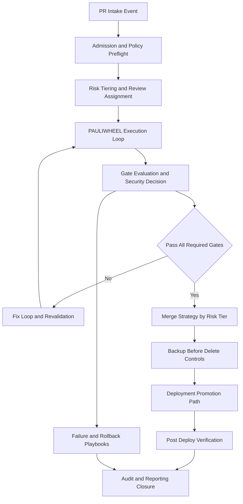

# ARCHONX Secure Automation Pipeline

## 1. Purpose and Scope

This document defines the secure end-to-end autonomous pipeline for repository operations under ArchonX governance.

It extends and operationalizes:
- [ARCHONX_AUTONOMOUS_AGENCY_BLUEPRINT.md](plans/ARCHONX_AUTONOMOUS_AGENCY_BLUEPRINT.md)
- [ARCHONX_SOP_AND_PROMPT_SYSTEM.md](plans/ARCHONX_SOP_AND_PROMPT_SYSTEM.md)
- [ARCHONX_HUMAN_LOOP_MINIMIZATION_MAP.md](plans/ARCHONX_HUMAN_LOOP_MINIMIZATION_MAP.md)
- [ARCHONX_REALITY_MAP_AND_GAP_PLAN.md](plans/ARCHONX_REALITY_MAP_AND_GAP_PLAN.md)

This artifact is planning-only and markdown-only.

---

## 2. Pipeline Security Objectives

1. Enforce deterministic admission and policy validation for every PR intake
2. Apply risk-tiered autonomous review and gate evaluation with explicit evidence
3. Run fix-loop and revalidation until all required controls pass or escalation is triggered
4. Enforce merge strategy by risk tier with fail-closed behavior
5. Guarantee backup-before-delete with 30-day retention path contract
6. Promote deployments across Hostinger, Railway, Vercel, and Cloudflare with progressive checks
7. Maintain immutable, machine-readable audit outputs under [ops/reports](ops/reports)

---

## 3. End-to-End Secure Pipeline Lifecycle

### 3.1 Stage 0 PR Intake and Policy Checks

**Entry conditions**
- PR metadata present with repo, branch, author, changed files
- bead id assigned or generated
- run id generated

**Mandatory checks**
- ACK status gate per [AGENTS.md](AGENTS.md)
- policy package presence
- branch protection and signed commit policy state
- scope check against protected paths
- initial secret scan and prohibited pattern scan

**Outputs**
- `ops/reports/pr_intake_<run_id>.json`
- `ops/reports/policy_preflight_<run_id>.json`

### 3.2 Stage 1 Automated Review Assignment and Gate Evaluation

**Assignment model**
- low: reviewer agent auto-assigned
- medium: reviewer and security guardian assigned, human required on policy trigger
- high: reviewer and security guardian plus mandatory human approver
- critical: same as high with incident-ready hold and explicit command path

**Gate set**
- CI and tests gate
- policy conformance gate
- security scan gate
- Context7 proof gate for third-party usage
- artifact completeness gate

**Outputs**
- `ops/reports/reviewer_assignment_<run_id>.json`
- `ops/reports/gate_eval_<run_id>.json`

### 3.3 Stage 2 Fix-Loop and Revalidation Cycle

All code-affecting iterations run through PAULIWHEEL beads loop:
- PLAN
- IMPLEMENT
- TEST
- EVALUATE
- PATCH
- REPEAT

**Loop controls**
- every patch references same bead lineage with incremented attempt id
- failed gate details must map to concrete patch actions
- loop hard stop policy for repeated non-convergence
- escalation ticket generated on stop condition

**Outputs**
- `ops/reports/beads_log_<run_id>.jsonl`
- `ops/reports/revalidation_<run_id>.json`
- `ops/reports/escalation_<run_id>.json` when triggered

### 3.4 Stage 3 Merge Strategy by Risk Tier

| Risk Tier | Merge Mode | Required Approvals | Additional Constraints |
|---|---|---|---|
| Low | Auto-merge after all gates pass | Agent reviewer | No open critical findings |
| Medium | Conditional auto-merge | Agent reviewer, human only when policy trigger fires | Rollback recipe required |
| High | Manual merge only | Agent reviewer, security guardian, human approver | Release hold until explicit approval |
| Critical | Incident-aware gated merge | Agent reviewer, security guardian, human approver, incident commander readiness | Mandatory change window and rollback drill evidence |

**Outputs**
- `ops/reports/merge_decision_<run_id>.json`
- `ops/reports/approval_log_<run_id>.json`

### 3.5 Stage 4 Backup-Before-Delete Policy and 30-Day Retention Contract

Any delete or destructive mutation must execute this contract first:
1. snapshot target paths and metadata
2. create integrity hash manifest
3. write restore index record
4. verify backup readability
5. only then allow delete

**Retention contract**
- minimum retention: 30 days
- retention path contract:
  - `ops/backups/<repo>/<yyyy-mm-dd>/<run_id>/`
- required backup artifacts:
  - `backup_manifest.json`
  - `backup_hashes.json`
  - `restore_map.json`
  - `delete_request.json`

**Purge policy**
- day 31+ purge only if no legal hold and no active incident tie
- purge action emits auditable report

**Outputs**
- `ops/reports/backup_predelete_<run_id>.json`
- `ops/reports/retention_status_<run_id>.json`
- `ops/reports/backup_purge_<run_id>.json` when applicable

### 3.6 Stage 5 Deployment Promotion Across Hostinger Railway Vercel Cloudflare

Promotion order is progressive with fail-closed gates:
1. Hostinger pre-prod validation lane
2. Railway service deploy lane
3. Vercel web edge lane
4. Cloudflare edge and DNS lane

**Promotion controls**
- environment policy and secret scope validation before each lane
- smoke tests and health probes per lane
- policy parity check against expected config contract
- automatic stop on regression threshold breach

**Outputs**
- `ops/reports/deploy_hostinger_<run_id>.json`
- `ops/reports/deploy_railway_<run_id>.json`
- `ops/reports/deploy_vercel_<run_id>.json`
- `ops/reports/deploy_cloudflare_<run_id>.json`
- `ops/reports/deploy_promotion_summary_<run_id>.json`

---

## 4. Mandatory Control Set

## 4.1 PAULIWHEEL and Beads Enforcement

- code-affecting operations require bead id
- loop stages PLAN IMPLEMENT TEST EVALUATE PATCH REPEAT are mandatory
- stage skip is policy violation and blocks merge
- Agent Lightning bootstrap is prerequisite before other functional changes in touched repos

Evidence:
- `ops/reports/beads_log_<run_id>.jsonl`
- `ops/reports/pauliwheel_stage_checks_<run_id>.json`

## 4.2 Context7 Compliance Checkpoints

For every third-party library touch:
1. `context7.resolve-library-id` proof recorded
2. `context7.get-library-docs` proof recorded
3. implementation references documented docs snapshot

Failure to provide proof results in:
- gate fail
- restricted status candidate
- escalation artifact creation

Evidence:
- `ops/reports/context7_proof_<run_id>.json`
- `ops/reports/dependency_touch_map_<run_id>.json`

## 4.3 Secrets Handling and Redaction Rules

**Handling rules**
- secrets never logged in plaintext
- secret values masked at source and sink
- environment-scoped least-privilege secret access
- secret rotation events tracked
- deny deploy when secret scope mismatch occurs

**Redaction rules**
- fixed redaction token format: `[REDACTED:<class>]`
- classes: key, token, password, connection_string, pii
- no exception for debug logs

Evidence:
- `ops/reports/secret_scan_<run_id>.json`
- `ops/reports/redaction_audit_<run_id>.json`
- `ops/reports/secret_scope_validation_<run_id>.json`

## 4.4 Audit Logging and Machine-Readable Reporting

All stages emit machine-readable artifacts under [ops/reports](ops/reports) with:
- run id
- bead id
- stage id and stage result
- gate status list
- decision actor type agent or human
- timestamp and signature
- final disposition merged blocked rolled_back escalated

Minimum closure reports:
- `ops/reports/pipeline_summary_<run_id>.json`
- `ops/reports/archonx_ops_doctor_<run_id>.json`

---

## 5. Failure and Rollback Playbooks

## 5.1 Trigger Conditions

Trigger rollback or controlled halt when any condition is met:
1. security critical finding unresolved at merge gate
2. health probe failure after deploy lane promotion
3. policy breach detected in runtime parity checks
4. secret leakage or redaction failure detection
5. deployment KPI regression beyond policy threshold
6. repeated fix-loop non-convergence beyond configured attempt ceiling

## 5.2 Playbook A PR Gate Failure

- block merge
- generate failure packet with failed gates and remediation hints
- route to fix-loop with preserved bead lineage
- if repeated failure threshold reached, escalate to human approver

Artifacts:
- `ops/reports/playbook_pr_gate_failure_<run_id>.json`

## 5.3 Playbook B Deployment Regression

- stop further promotion lanes
- rollback latest lane to last known good state
- execute post-rollback smoke checks
- open incident record if severity threshold crossed

Artifacts:
- `ops/reports/playbook_deploy_regression_<run_id>.json`
- `ops/reports/rollback_log_<run_id>.jsonl`

## 5.4 Playbook C Secret or Policy Breach

- enter restricted mode for affected run scope
- revoke ephemeral tokens and rotate impacted secrets
- freeze merge queue for affected repo or lane
- require security guardian and human command sign-off before resume

Artifacts:
- `ops/reports/playbook_secret_policy_breach_<run_id>.json`
- `ops/reports/restriction_event_<run_id>.json`

## 5.5 Playbook D Delete Restore Invocation

- if post-delete verification fails, restore from latest backup manifest
- verify file integrity against backup hashes
- mark run disposition as rolled_back if restoration succeeds

Artifacts:
- `ops/reports/playbook_delete_restore_<run_id>.json`
- `ops/reports/restore_verification_<run_id>.json`

---

## 6. Control Matrix Stage to Owner Role to Required Evidence

| Pipeline Stage | Owner Agent Role | Required Evidence Artifact |
|---|---|---|
| PR intake and policy preflight | Control Plane Governor | `ops/reports/pr_intake_<run_id>.json`, `ops/reports/policy_preflight_<run_id>.json` |
| Risk tiering and reviewer assignment | Orchestration Coordinator | `ops/reports/reviewer_assignment_<run_id>.json`, `ops/reports/risk_tier_<run_id>.json` |
| PAULIWHEEL loop execution | Repo Execution Crew | `ops/reports/beads_log_<run_id>.jsonl`, `ops/reports/pauliwheel_stage_checks_<run_id>.json` |
| Context7 compliance enforcement | Context7 Guard and Reviewer Agent | `ops/reports/context7_proof_<run_id>.json`, `ops/reports/dependency_touch_map_<run_id>.json` |
| Security and policy gate evaluation | Security Guardian | `ops/reports/gate_eval_<run_id>.json`, `ops/reports/security_findings_<run_id>.json` |
| Merge decision and approval routing | Reviewer Agent plus Human Approver by tier | `ops/reports/merge_decision_<run_id>.json`, `ops/reports/approval_log_<run_id>.json` |
| Backup-before-delete control | Reporting and Evidence Agent | `ops/reports/backup_predelete_<run_id>.json`, `ops/backups/<repo>/<yyyy-mm-dd>/<run_id>/backup_manifest.json` |
| Retention governance and purge | Reporting and Evidence Agent with Security Guardian oversight | `ops/reports/retention_status_<run_id>.json`, `ops/reports/backup_purge_<run_id>.json` |
| Hostinger deployment lane | Deployment Orchestrator | `ops/reports/deploy_hostinger_<run_id>.json` |
| Railway deployment lane | Deployment Orchestrator | `ops/reports/deploy_railway_<run_id>.json` |
| Vercel deployment lane | Deployment Orchestrator | `ops/reports/deploy_vercel_<run_id>.json` |
| Cloudflare deployment lane | Deployment Orchestrator | `ops/reports/deploy_cloudflare_<run_id>.json` |
| Post-deploy verification and closure | Reporting and Evidence Agent | `ops/reports/deploy_promotion_summary_<run_id>.json`, `ops/reports/pipeline_summary_<run_id>.json`, `ops/reports/archonx_ops_doctor_<run_id>.json` |
| Incident and rollback command path | Incident Orchestrator and Human Operator of Last Resort for SEV1 | `ops/reports/rollback_log_<run_id>.jsonl`, `ops/reports/incident_timeline_<run_id>.json` |

---

## 7. Implementation Handoff Checklist for Code Mode

Use this checklist as the execution contract for [Code mode](README.md):

1. Create pipeline policy objects for all stages defined in this file
2. Implement fail-closed gate evaluator with risk-tier matrix behavior
3. Add reviewer assignment engine with role routing by risk tier
4. Implement PAULIWHEEL stage validator and bead lineage persistence
5. Add Context7 proof capture hooks for dependency changes
6. Add secret scan, scope validation, and redaction audit hooks
7. Implement backup-before-delete orchestration and restore verification
8. Add 30-day retention scheduler and purge guard with legal hold gate
9. Implement deployment lane orchestrator for Hostinger Railway Vercel Cloudflare
10. Add rollback executors bound to trigger conditions in Section 5
11. Emit all required machine-readable artifacts under [ops/reports](ops/reports)
12. Add dashboard ingestion mapping for pipeline and incident outputs
13. Add integration tests for pass path, fail path, rollback path, and escalation path
14. Add verification run that includes `archonx-ops doctor` output in closure artifacts
15. Document operational runbook references and escalation ownership

Definition of done for implementation handoff:
- all stage artifacts are generated and schema-valid
- missing mandatory artifact causes blocked disposition
- risk-tier merge behavior matches Section 3.4 matrix
- delete operations cannot execute without backup evidence
- deployment promotions stop automatically on failed lane checks

---

## 8. Acceptance Criteria for This Pipeline Plan

This plan is accepted when:
1. end-to-end PR to deployment flow is explicit and risk-tiered
2. all mandatory controls are captured with evidence outputs
3. failure and rollback playbooks include trigger conditions and actions
4. stage to role to evidence control matrix is complete
5. implementation handoff checklist is executable without ambiguity
6. all reporting paths are machine-readable under [ops/reports](ops/reports)

This document is the secure automation pipeline source-of-truth for downstream implementation sequencing.