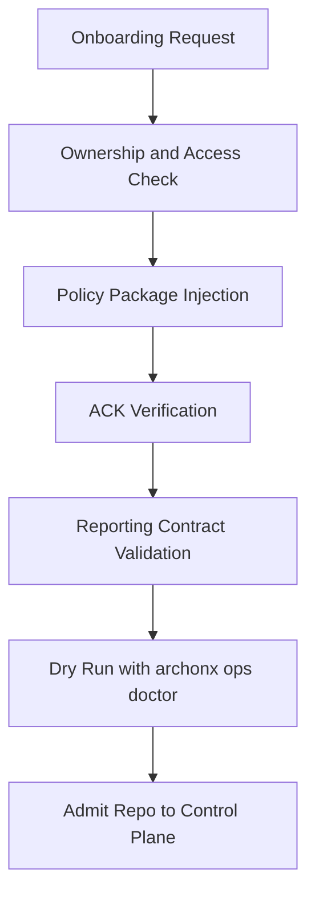
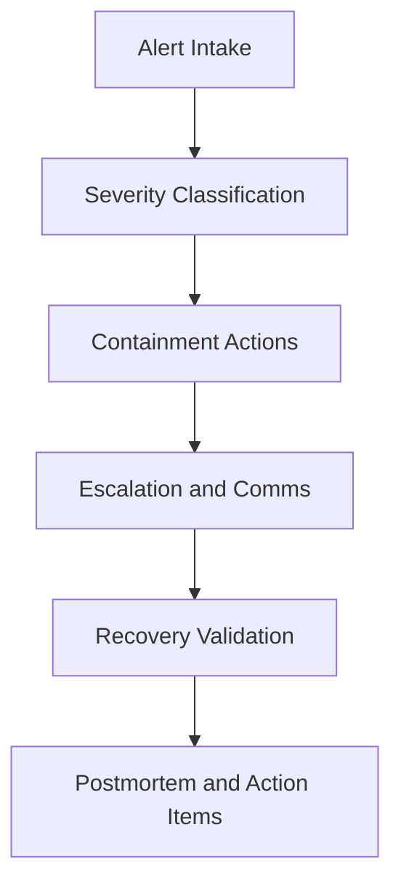

# ARCHONX SOP and Prompt System Standard

## 1. Purpose and Scope

This document defines the reusable SOP suite and prompt template system for ArchonX multi-repo operations, aligned to [`ARCHONX_AUTONOMOUS_AGENCY_BLUEPRINT.md`](plans/ARCHONX_AUTONOMOUS_AGENCY_BLUEPRINT.md).

This planning artifact standardizes execution across teams, repos, and client brands while preserving mandatory governance:
- PAULIWHEEL default behavior
- beads plus Ralphy loop stages PLAN IMPLEMENT TEST EVALUATE PATCH REPEAT
- Context7 compliance workflow before third party library usage
- ACK gate enforcement
- machine readable reporting including `archonx-ops doctor`

Brand normalization is mandatory in all templates and outputs:
- THE PAULI EFFECT™
- Yappyverse™
- La Mariposa

---

## 2. Design Principles for SOP and Prompt Standardization

1. Single contract model across repos with controlled local variants
2. Deterministic run lifecycle with traceable evidence per bead id
3. Prompt packs that map directly to SOP stages and governance gates
4. Human touchpoints limited to approvals exceptions strategy and incident command
5. Brand language normalization embedded in all generated artifacts

---

## 3. Canonical SOP Suite

### 3.1 SOP Registry

| SOP ID | SOP Name | Primary Outcome | Mandatory Gates |
|---|---|---|---|
| SOP-ONBOARD | Repo Onboarding | Repo admitted into ArchonX control plane | ACK gate policy bootstrap reporting contract |
| SOP-DEVREV | Coding and Review Lifecycle | Change implemented and reviewed through PAULIWHEEL | bead id loop evidence Context7 compliance |
| SOP-PRGATE | PR Approval and Merge Gates | Merge decision with governance evidence | risk tier policy checks approvals quality gates |
| SOP-RELEASE | Deployment and Rollback | Safe release and deterministic recovery | release checks rollback recipe post deploy verification |
| SOP-INCIDENT | Incident Response and Reporting | Structured severity handling and audit | incident triage escalation comms postmortem |
| SOP-GROWTH | Content and Lead Gen Operations | Brand safe campaign execution and reporting | brand policy legal checks quality review attribution |

### 3.2 SOP Shared Metadata Contract

Each SOP instance uses this header:

```yaml
sop_meta:
  sop_id: SOP-XXXX
  version: 1.0.0
  owner_team: team-slug
  applies_to:
    - repo-or-brand-scope
  risk_tier: low|medium|high|critical
  required_roles:
    - orchestrator
    - architect
    - implementer
    - reviewer
  required_artifacts:
    - run_manifest
    - archonx_ops_doctor_report
  governance:
    pauliwheel_required: true
    beads_loop_required: true
    context7_required_for_third_party: true
    ack_gate_required: true
```

---

## 4. SOP Templates

## 4.1 SOP-ONBOARD Repo Onboarding Template

### Objective
Admit a repo into ArchonX autonomous operation with enforceable policy contracts.

### Inputs
- Repo identity and ownership
- Branch protection baseline
- Existing CI and release flow
- Current agent configuration state

### Outputs
- Onboarding decision pass or blocked
- Policy package installed and acknowledged
- Reporting schema mapped
- Initial control plane registration record

### Workflow


### Required Checklist
- [ ] Repo owner confirmed
- [ ] PAULIWHEEL default declared
- [ ] beads loop hooks active
- [ ] Context7 compliance rule wired
- [ ] ACK gate status green
- [ ] `archonx-ops doctor` report emitted under `ops/reports/`
- [ ] Brand terms policy loaded with THE PAULI EFFECT™ Yappyverse™ La Mariposa

### Evidence Artifacts
- onboarding-manifest.json
- ack-status.json
- governance-checks.json
- ops/reports/onboarding-doctor.json

---

## 4.2 SOP-DEVREV Coding and Review Lifecycle Template

### Objective
Run deterministic implementation and review cycle for code-affecting tasks.

### Inputs
- Scoped work item with bead id
- Repo policies and quality gates
- Dependency list requiring Context7 doc retrieval

### Outputs
- PR ready change set
- Verification results
- Reviewer decision and exceptions log

### Workflow Contract
1. PLAN with bead id and risk tier
2. IMPLEMENT with policy guardrails
3. TEST with required suites
4. EVALUATE against quality and security
5. PATCH as needed
6. REPEAT until gates pass

### Mandatory Execution Rules
- Every code-affecting operation references bead id
- Third party calls require Context7 resolve plus docs retrieval before implementation
- Reviewer confirms no policy bypass
- Generate machine readable run evidence

### Evidence Artifacts
- beads-log.jsonl
- test-summary.json
- policy-results.json
- review-decision.md

---

## 4.3 SOP-PRGATE PR Approval and Merge Gates Template

### Objective
Standardize merge readiness and approval decisions across risk tiers.

### Inputs
- PR metadata
- Test and policy outputs
- Risk tier and approval matrix

### Outputs
- Merge approved
- Merge blocked with reasons
- Escalation ticket for human arbitration

### Gate Matrix

| Gate | Low | Medium | High | Critical |
|---|---|---|---|---|
| CI and tests | Required | Required | Required | Required |
| Policy checks | Required | Required | Required | Required |
| Security scan | Required | Required | Required | Required plus manual review |
| Human approver | Optional | Required by policy trigger | Required | Required |
| Incident rollback recipe attached | Recommended | Required | Required | Required |

### Merge Decision Output Template
```yaml
merge_decision:
  pr_id: PR-XXX
  risk_tier: medium
  status: approved|blocked|escalated
  failed_gates:
    - gate-name
  approvals:
    human:
      required: true
      approver: handle
    agent:
      reviewer_pack: reviewer-v1
  final_disposition: merged|blocked|escalated
```

---

## 4.4 SOP-RELEASE Deployment and Rollback Template

### Objective
Deploy safely with deterministic rollback and post deploy validation.

### Inputs
- Approved PR bundle
- Environment target and config
- Rollback recipe and checkpoints

### Outputs
- Deployment status
- Post deploy verification summary
- Rollback report if invoked

### Deployment Checklist
- [ ] Release tag and change manifest generated
- [ ] Environment policy and secret checks passed
- [ ] Health probes baseline captured
- [ ] Rollback command set validated
- [ ] Post deploy smoke tests passed
- [ ] `archonx-ops doctor` release report published

### Rollback Trigger Conditions
- Failed health threshold
- Policy breach in runtime checks
- Incident commander request
- Critical business KPI regression

### Evidence Artifacts
- release-manifest.json
- deploy-log.jsonl
- rollback-log.jsonl
- post-deploy-checks.json

---

## 4.5 SOP-INCIDENT Incident Response and Reporting Template

### Objective
Contain incidents quickly with clear escalation and auditability.

### Inputs
- Alert source and severity
- Impacted repos services brands
- Current mitigation state

### Outputs
- Incident record with timeline
- Stakeholder communications log
- Corrective action backlog and postmortem

### Severity Routing
- SEV1 immediate human command with automation constrained
- SEV2 agent led mitigation with human oversight
- SEV3 queued remediation with standard monitoring

### Response Flow


### Required Incident Artifacts
- incident-commander-log.md
- timeline.json
- impact-assessment.json
- corrective-actions.md

---

## 4.6 SOP-GROWTH Content and Lead Gen Operations Template

### Objective
Operate growth workflows for client brands with policy safe messaging and measurable outcomes.

### Inputs
- Brand brief
- Campaign objectives and channels
- Compliance constraints

### Outputs
- Approved content pack
- Launch checklist
- Performance report and optimization actions

### Mandatory Brand and Governance Rules
- Use THE PAULI EFFECT™ and Yappyverse™ naming exactly when in scope
- Refer to Ivette as La Mariposa in all generated material
- Apply legal and policy review gates before publishing
- Keep attribution and provenance for claims and assets

### Execution Checklist
- [ ] Content strategy approved
- [ ] Prompt pack selected by brand and campaign type
- [ ] Legal and policy check passed
- [ ] Channel publish checklist completed
- [ ] Lead quality telemetry captured
- [ ] Weekly optimization report generated

### Evidence Artifacts
- campaign-brief.md
- approved-copy.md
- publish-log.json
- lead-quality-report.json

---

## 5. Reusable Prompt Template Library

## 5.1 Prompt Pack Structure

Each prompt pack follows this envelope:

```yaml
prompt_pack:
  pack_id: role-pack-v1
  role: orchestrator|architect|coder|reviewer|security|growth
  version: 1.0.0
  intent: concise-intent
  mandatory_policies:
    - pauliwheel
    - beads_loop
    - context7_before_third_party
    - ack_gates
  brand_language:
    required_terms:
      - THE PAULI EFFECT™
      - Yappyverse™
      - La Mariposa
  input_contract:
    required_fields:
      - objective
      - constraints
      - repo_scope
      - risk_tier
  output_contract:
    required_fields:
      - plan_or_result
      - evidence_artifacts
      - gate_status
```

## 5.2 Role Prompt Templates

### Orchestrator Prompt Template
- Mission: coordinate cross repo execution sequence and gate injection
- Must output dependency ordered run plan and escalation points
- Must emit run manifest and governance status summary

### Architect Prompt Template
- Mission: translate objective into implementable architecture and SOP mapping
- Must define contracts interfaces and risk boundaries
- Must provide handoff checklist for implementers

### Coder Implementer Prompt Template
- Mission: execute scoped change strictly via bead driven loop
- Must log PLAN IMPLEMENT TEST EVALUATE PATCH REPEAT evidence
- Must not bypass Context7 workflow for third party usage

### Reviewer Prompt Template
- Mission: validate quality policy and merge readiness
- Must return approve block escalate with explicit failed gates
- Must verify artifact completeness and policy conformance

### Security Guardian Prompt Template
- Mission: enforce security controls and threat checks per change
- Must classify findings by severity and remediation requirement
- Must veto merge on unresolved critical findings

### Growth Content Operator Prompt Template
- Mission: produce and optimize content and lead gen operations by brand
- Must enforce brand lexicon and claims policy
- Must output campaign telemetry hooks and optimization actions

---

## 6. Team and Brand Mapping Matrix

| Team or Brand Pod | SOP Variants Applied | Prompt Packs | Notes |
|---|---|---|---|
| Control Plane Team | SOP-ONBOARD SOP-PRGATE SOP-INCIDENT | orchestrator architect reviewer security | Owns admission governance and escalations |
| Repo Delivery Team | SOP-DEVREV SOP-PRGATE SOP-RELEASE | architect coder reviewer security | Executes beads lifecycle and release readiness |
| Platform Reliability Team | SOP-RELEASE SOP-INCIDENT | orchestrator security reviewer | Owns deploy safety rollback and incident recovery |
| Growth Ops Team | SOP-GROWTH SOP-PRGATE | growth orchestrator reviewer | Owns campaign lifecycle and performance loops |
| THE PAULI EFFECT™ Brand Pod | SOP-GROWTH SOP-INCIDENT | growth architect reviewer | Premium narrative governance and brand integrity |
| Yappyverse™ Brand Pod | SOP-GROWTH SOP-DEVREV | growth coder reviewer | Creative velocity with policy locked outputs |
| La Mariposa Executive Stream | SOP-PRGATE SOP-INCIDENT SOP-RELEASE | orchestrator architect security | Strategic approvals and exception arbitration |
| Client Brand Pods Generic | SOP-GROWTH SOP-PRGATE SOP-RELEASE | growth orchestrator reviewer security | Uses tenant specific policy overlays |

---

## 7. Versioning and Update Policy

## 7.1 Semantic Versioning for SOP and Prompt Artifacts

- Major version for breaking contract changes
- Minor version for backward compatible additions
- Patch version for clarifications typo fixes non breaking refinements

## 7.2 Change Control Workflow

1. Propose change with rationale and impacted SOP prompt packs
2. Run policy compatibility review against current governance contracts
3. Approve via designated human authority for major changes
4. Publish updated artifact and migration notes
5. Require ACK refresh for affected agents teams repos

## 7.3 Artifact Governance Rules

- Every artifact includes owner last review date and next review trigger
- Deprecated versions carry sunset date and migration path
- No silent edits to active major versions
- All updates produce machine readable changelog entry

### Changelog Entry Template
```yaml
change_record:
  artifact_id: SOP-DEVREV
  from_version: 1.1.0
  to_version: 1.2.0
  change_type: minor
  summary: added reviewer gate evidence field
  requires_ack_refresh: true
  effective_after: yyyy-mm-dd
```

---

## 8. Acceptance Criteria for Implementation Teams

Implementation of this system is accepted only when all criteria pass:

1. SOP Registry Activation
- All six SOPs are instantiated in target repos or control plane registry
- SOP metadata contract validated and versioned

2. Prompt Pack Availability
- All six core role prompt packs published with envelope fields complete
- Prompt packs mapped to SOP stages without gaps

3. Governance Enforcement
- PAULIWHEEL beads loop ACK gates and Context7 flow verified in run policy
- `archonx-ops doctor` evidence appears for onboarding release and incident flows

4. Mapping Matrix Operationalization
- Every team and brand pod has assigned SOP variants and prompt packs
- Exceptions documented and approved

5. Brand Protocol Compliance
- Outputs consistently include THE PAULI EFFECT™ Yappyverse™ and La Mariposa rules as applicable
- Violations are detectable through policy checks

6. Auditability and Reporting
- Machine readable artifacts generated for each SOP execution
- Audit trail can reconstruct decision path from intake to disposition

7. Handoff Readiness
- Another execution mode can implement directly from this document without ambiguity
- Required templates and checklists are complete and internally consistent

---

## 9. Implementation Handoff Guidance

Use this document with [`ARCHONX_AUTONOMOUS_AGENCY_BLUEPRINT.md`](plans/ARCHONX_AUTONOMOUS_AGENCY_BLUEPRINT.md) as the paired governance package:
- Blueprint defines enterprise architecture and boundaries
- This file defines operational SOP and prompt standardization contracts

No code changes are included in this artifact. This is markdown planning only.
