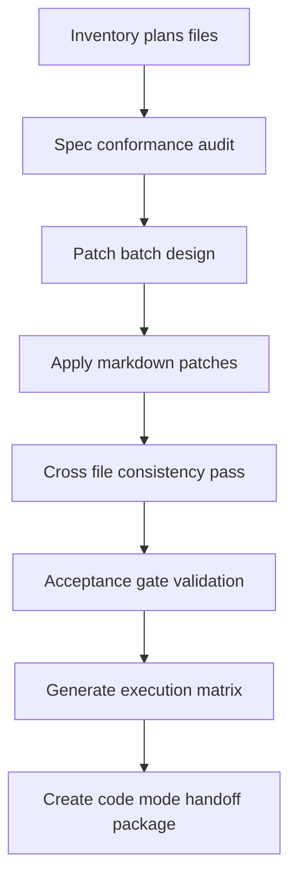

# ARCHONX Spec-Driven Documentation Patch and Execution PRD

## 1. Purpose

This PRD defines how to patch, normalize, validate, and execute all planning markdown artifacts under [`plans`](plans), then operationalize them through implementation-ready handoff packages.

Primary outcomes:
- complete the planning stack with a phased execution roadmap
- enforce a single documentation spec across all plan artifacts
- create deterministic patch workflow and acceptance gates
- generate implementation contracts consumable by code mode

## 2. Scope

In-scope artifacts:
- [`ARCHONX_AUTONOMOUS_AGENCY_BLUEPRINT.md`](plans/ARCHONX_AUTONOMOUS_AGENCY_BLUEPRINT.md)
- [`ARCHONX_SOP_AND_PROMPT_SYSTEM.md`](plans/ARCHONX_SOP_AND_PROMPT_SYSTEM.md)
- [`ARCHONX_HUMAN_LOOP_MINIMIZATION_MAP.md`](plans/ARCHONX_HUMAN_LOOP_MINIMIZATION_MAP.md)
- [`ARCHONX_REALITY_MAP_AND_GAP_PLAN.md`](plans/ARCHONX_REALITY_MAP_AND_GAP_PLAN.md)
- [`ARCHONX_SECURE_AUTOMATION_PIPELINE.md`](plans/ARCHONX_SECURE_AUTOMATION_PIPELINE.md)
- [`ARCHONX_DASHBOARD_CONTROL_WORKFLOWS.md`](plans/ARCHONX_DASHBOARD_CONTROL_WORKFLOWS.md)

To be created and governed by this PRD:
- phased implementation roadmap
- documentation execution matrix
- patch ledger and changelog linkage

Out-of-scope:
- non-markdown source refactors
- runtime deployments
- infra credential changes

## 3. Documentation Spec

Each plan file must contain these sections in order:
1) Intent and business objective
2) Inputs and dependencies
3) Normative requirements using MUST, SHOULD, MAY
4) Workflow sequence with role ownership
5) Data contracts and evidence paths under `ops/reports`
6) Compliance gates and failure handling
7) Acceptance criteria with measurable pass conditions
8) Handoff instructions for code mode

### Style constraints
- deterministic headings and subsection naming
- no ambiguous placeholders
- all artifacts referenced with relative paths
- every operational claim mapped to an evidence artifact path

## 4. Execution Model

## 5. Patch Strategy

### Batch A: Structural normalization
- normalize section order and heading hierarchy
- add missing required sections
- align terminology across files

### Batch B: Contract hardening
- define required payloads and expected outputs
- add policy gates and escalation rules
- map evidence paths to `ops/reports`

### Batch C: Execution hardening
- link each strategy item to implementable work packets
- define completion signals
- add rollback and exception pathways

### Batch D: Final synthesis
- publish phased roadmap doc
- publish execution matrix doc
- reconcile cross references across all plan files

## 6. Acceptance Gates

Gate 1: Spec Conformance
- each file contains all required sections
- no unresolved TODO markers

Gate 2: Contract Completeness
- every workflow includes trigger, payload, gate, telemetry, evidence

Gate 3: Governance Traceability
- each control maps to PAULIWHEEL and compliance expectations from [`AGENTS.md`](AGENTS.md)

Gate 4: Implementation Readiness
- each file includes explicit handoff tasks that code mode can execute without reinterpretation

## 7. Self-Execution PRD Tasks

1) complete phased roadmap artifact
2) run full plans directory conformance review
3) patch all non-conforming sections
4) publish execution matrix with owner and acceptance mapping
5) finalize documentation patch ledger
6) issue implementation handoff bundle

## 8. Deliverables

- [`ARCHONX_PHASED_IMPLEMENTATION_ROADMAP.md`](plans/ARCHONX_PHASED_IMPLEMENTATION_ROADMAP.md)
- [`ARCHONX_DOC_EXECUTION_MATRIX.md`](plans/ARCHONX_DOC_EXECUTION_MATRIX.md)
- [`ARCHONX_DOC_PATCH_LEDGER.md`](plans/ARCHONX_DOC_PATCH_LEDGER.md)
- updated existing plans files normalized to spec

## 9. Risks and Controls

Risks:
- drift between planning docs and code reality
- duplicate directives across files
- missing proof artifacts for governance controls

Controls:
- single source mapping in execution matrix
- patch ledger with change rationale
- acceptance gates blocking handoff when unmet

## 10. Definition of Done

Done is achieved when:
- roadmap, matrix, and patch ledger exist and are cross linked
- all in-scope plan files are spec conformant
- each file has implementation-ready acceptance criteria
- handoff package can be executed in code mode without additional planning interpretation
