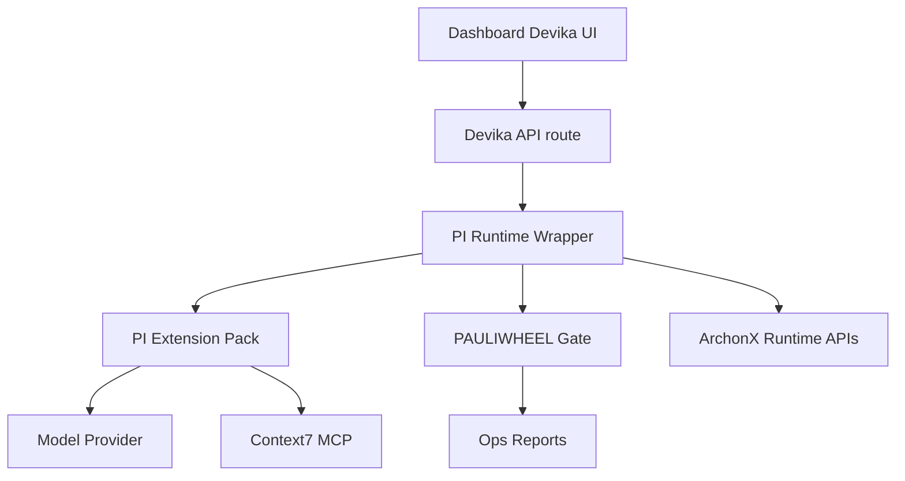

# DEVIKA on PI Integration Plan

## Objective

Integrate [`@mariozechner/pi-coding-agent`](https://www.npmjs.com/package/@mariozechner/pi-coding-agent) as the execution harness for Devika in ArchonX OS, with PAULIWHEEL governance, MCP doc-checking via Context7, and a clean handoff boundary for King Mode to Gemini 3.1.

## Scope Boundary

- In scope
  - PI installation strategy and reproducible setup
  - Devika runtime profile and orchestration behavior
  - Safety, compliance, and observability wrapper
  - Dashboard and backend contract updates for Devika execution profiles
  - Gap analysis and closure plan
  - Handoff pack for King Mode to Gemini 3.1
- Out of scope
  - Building King Mode features directly in this track

## Current Baseline and Known Gaps

1. Devika page hardcodes model in UI request payload at [`model_id`](../dashboard-agent-swarm/src/pages/DevikaAgent.tsx)
2. Devika health check lifecycle uses state initializer pattern at [`fetch DEVIKA health`](../dashboard-agent-swarm/src/pages/DevikaAgent.tsx)
3. Runtime execution route is generic and not PI-aware at [`POST /run`](../dashboard-agent-swarm/server/routes/agents.ts)
4. No dedicated Devika runtime identity/config pack comparable to Darya registry/config under [`agents/darya`](../agents/darya)
5. No PI extension pack in repo for task-loop, subagents, guardrails
6. No explicit Context7 MCP wiring into Devika coding lifecycle
7. No enforced PAULIWHEEL bead gate before agentic code-affecting operations
8. No standardized `archonx-ops doctor` + report emit path in Devika agent loop

## Target Architecture

## Workstream Plan

### WS1 Install and Bootstrap Standard

Deliverables
- `scripts/pi/install-devika-pi.ps1`
- `scripts/pi/install-devika-pi.sh`
- `scripts/pi/check-devika-pi.ps1`
- `scripts/pi/check-devika-pi.sh`
- `docs/devika-pi/00-install.md`

Standards
- Pin PI version in scripts
- Verify node/npm versions
- Verify PI CLI availability and version
- Emit machine-readable setup report under `ops/reports/`

### WS2 PAULIWHEEL Governance Wrapper

Deliverables
- `archonx/tools/devika_pi_wrapper.py`
- `archonx/security/devika_pi_policy.py`
- `archonx/config/devika_pi_policy.yaml`

Behavior
- Require bead id before code-affecting operations
- Enforce loop stages PLAN IMPLEMENT TEST EVALUATE PATCH REPEAT
- Command allowlist and restricted command blocks
- Require verification command sequence and report writeout

### WS3 Devika PI Profile and Extension Pack

Deliverables
- `agents/devika/config.json`
- `agents/devika/system_prompt.md`
- `agents/devika/pi/profile.json`
- `agents/devika/pi/extensions/` with:
  - task loop extension
  - subagent orchestration extension
  - status widget extension
  - safe command policy extension

Profile requirements
- No UI hardcoded model IDs
- Profile-based model routing defaults
- Fallback strategy for model/provider failure

### WS4 Context7 MCP Wiring

Deliverables
- `archonx/config/mcp/context7.json`
- `agents/devika/pi/mcp/context7.policy.json`
- `docs/devika-pi/10-context7-usage.md`

Behavior
- Resolve library id before third-party API usage
- Fetch docs and cache reference summary in run context
- Fail-safe mode if Context7 unavailable

### WS5 Dashboard and API Contract Upgrade

Deliverables
- Update Devika request contract to include `executionProfile`
- Add backend PI runtime route
- Add status telemetry states for PI phases

Required changes
- Frontend: replace raw model id with profile selector
- Backend: route profile to PI wrapper
- Logging: include profile, bead id, gate decisions

### WS6 Gap Closure Matrix and Acceptance Gates

Deliverables
- `plans/DEVIKA_PI_GAP_MATRIX.md`
- `ops/reports/devika_pi_readiness.json`

Acceptance gates
- Install gate passes on target environments
- Policy wrapper blocks unsafe commands
- Context7 pre-code check visible in logs
- Verification and report emission confirmed
- Rollback path documented and tested

### WS7 Gemini 3.1 King Mode Handoff Pack

Deliverables
- Refresh and tighten [`KING_MODE_GEMINI_31_PRD.md`](./KING_MODE_GEMINI_31_PRD.md)
- `plans/KING_MODE_GEMINI_31_BUILD_PROMPT_STRICT.md`
- `plans/KING_MODE_GEMINI_31_CONTEXT_BUNDLE.md`

Boundary
- Devika-on-PI and governance complete first
- King Mode implementation remains deferred to Gemini 3.1 execution track

## Execution Sequence

1. WS1 install standard
2. WS2 governance wrapper
3. WS3 profile and extension pack
4. WS4 Context7 MCP
5. WS5 dashboard and API contract
6. WS6 gaps and acceptance gates
7. WS7 Gemini handoff finalization

## Risk Register

- PI version drift
  - Mitigation: pinned install and version checks
- Unsafe shell operations
  - Mitigation: wrapper allowlist and policy blocks
- MCP availability instability
  - Mitigation: fallback mode and retry policy
- UI/backend contract mismatch
  - Mitigation: typed contract and integration tests

## Definition of Done

- Devika runs through PI profile, not raw model id
- PAULIWHEEL and bead requirements enforced in runtime wrapper
- Context7 docs flow integrated and observable
- `archonx-ops doctor` flow integrated in verification pipeline
- Reports emitted under `ops/reports/`
- King Mode handoff package is complete and strict for Gemini 3.1

