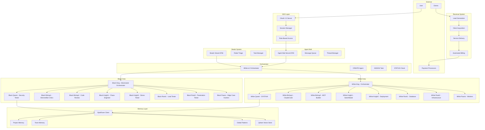

# 🎯 ArchonX OS - 12-Agent Framework Completion Plan
## Goal: $100 Million by 2030 New Year's

**Created:** 2026-02-19  
**Status:** Planning Phase  
**Location:** `C:\archonx-os-main`

---

## 📊 Current State Analysis

### ✅ What's Built

#### Core Infrastructure
| Component | File | Status |
|-----------|------|--------|
| Kernel | [`archonx/kernel.py`](archonx/kernel.py) | ✅ Complete |
| CLI | [`archonx/cli.py`](archonx/cli.py) | ✅ Complete |
| Server | [`archonx/server.py`](archonx/server.py) | ✅ Complete |
| Config | [`archonx/config/archonx-config.json`](archonx/config/archonx-config.json) | ✅ Complete |

#### Crews (White/Black)
| Component | File | Status |
|-----------|------|--------|
| Base Crew | [`archonx/crews/base.py`](archonx/crews/base.py) | ✅ Complete |
| White Crew | [`archonx/crews/white_crew.py`](archonx/crews/white_crew.py) | ✅ Complete |
| Black Crew | [`archonx/crews/black_crew.py`](archonx/crews/black_crew.py) | ✅ Complete |

#### Core Agents
| Component | File | Status |
|-----------|------|--------|
| Agents | [`archonx/core/agents.py`](archonx/core/agents.py) | ✅ Complete |
| Agent Mail | [`archonx/core/agent_mail.py`](archonx/core/agent_mail.py) | ✅ Complete |
| Protocol | [`archonx/core/protocol.py`](archonx/core/protocol.py) | ✅ Complete |
| Brenner Protocol | [`archonx/core/brenner_protocol.py`](archonx/core/brenner_protocol.py) | ✅ Complete |
| Tyrone Protocol | [`archonx/core/tyrone_protocol.py`](archonx/core/tyrone_protocol.py) | ✅ Complete |
| Chess Reasoning | [`archonx/core/chess_reasoning.py`](archonx/core/chess_reasoning.py) | ✅ Complete |
| Flywheel | [`archonx/core/flywheel.py`](archonx/core/flywheel.py) | ✅ Complete |
| Metrics | [`archonx/core/metrics.py`](archonx/core/metrics.py) | ✅ Complete |
| Self Build | [`archonx/core/self_build.py`](archonx/core/self_build.py) | ✅ Complete |

#### Skills (25+ Implemented)
| Skill | File | Status |
|-------|------|--------|
| Web Scraping | [`archonx/skills/web_scraping.py`](archonx/skills/web_scraping.py) | ✅ Complete |
| Content Writing | [`archonx/skills/content_writing.py`](archonx/skills/content_writing.py) | ✅ Complete |
| SEO Optimization | [`archonx/skills/seo_optimization.py`](archonx/skills/seo_optimization.py) | ✅ Complete |
| Lead Generation | [`archonx/skills/lead_generation.py`](archonx/skills/lead_generation.py) | ✅ Complete |
| Invoice Management | [`archonx/skills/invoice_management.py`](archonx/skills/invoice_management.py) | ✅ Complete |
| Customer Support | [`archonx/skills/customer_support.py`](archonx/skills/customer_support.py) | ✅ Complete |
| File Organization | [`archonx/skills/file_organization.py`](archonx/skills/file_organization.py) | ✅ Complete |
| Form Filling | [`archonx/skills/form_filling.py`](archonx/skills/form_filling.py) | ✅ Complete |
| Story Toolkit | [`archonx/skills/story_toolkit.py`](archonx/skills/story_toolkit.py) | ✅ Complete |
| Polly Character | [`archonx/skills/polly_character.py`](archonx/skills/polly_character.py) | ✅ Complete |
| Email Management | [`archonx/skills/email_management.py`](archonx/skills/email_management.py) | ✅ Complete |
| Upwork Scout | [`archonx/skills/upwork_scout.py`](archonx/skills/upwork_scout.py) | ✅ Complete |

#### MCP Servers (Integrated)
| Server | Location | Status |
|--------|----------|--------|
| Chrome DevTools | [`archonx/tools/chrome-devtools-mcp/`](archonx/tools/chrome-devtools-mcp/) | ✅ Cloned |
| Bright Data | [`archonx/tools/brightdata-mcp/`](archonx/tools/brightdata-mcp/) | ✅ Cloned |
| Orgo MCP | [`archonx/tools/orgo-mcp/`](archonx/tools/orgo-mcp/) | ✅ Cloned |

#### Orchestration
| Component | File | Status |
|-----------|------|--------|
| Swarm | [`archonx/orchestration/swarm.py`](archonx/orchestration/swarm.py) | ✅ Complete |

#### Security
| Component | File | Status |
|-----------|------|--------|
| Anti-Scraping | [`archonx/security/anti_scraping.py`](archonx/security/anti_scraping.py) | ✅ Complete |
| Encryption | [`archonx/security/encryption.py`](archonx/security/encryption.py) | ✅ Complete |
| Prompt Injection | [`archonx/security/prompt_injection.py`](archonx/security/prompt_injection.py) | ✅ Complete |

---

### ❌ What's Missing (Critical for $100M Goal)

#### 1. ByteRover Memory Integration
**Principle 2: MASTER THE CORE FOUR**
- ❌ Persistent memory layer
- ❌ Project/Team/Global memory layers
- ❌ Context retrieval system
- ❌ Vector store integration (Qdrant)

#### 2. 64-Agent Chess Board Structure
**Principle 7: SPECIALIZED AGENTS**
- ❌ White Crew (32 agents): King, Queen, Bishops, Knights, Rooks, Pawns
- ❌ Black Crew (32 agents): King, Queen, Bishops, Knights, Rooks, Pawns
- ❌ Chess position notation in Agent Mail
- ❌ Competitive scoring system

#### 3. Orchestrator Commands
**Principle 9: MULTI-AGENT ORCHESTRATION**
- ❌ CREATE agent
- ❌ ASSIGN task
- ❌ STATUS check
- ❌ PAUSE agent
- ❌ RESUME agent
- ❌ TERMINATE agent

#### 4. Agent Mail Server
**Principle 1: OUT OF THE LOOP ENGINEERING**
- ❌ Port 8765 WebSocket server
- ❌ Message queuing
- ❌ Thread management
- ❌ Acknowledgment system

#### 5. Beads Viewer Dashboard
**Principle 1: OUT OF THE LOOP ENGINEERING**
- ❌ Port 8766 dashboard
- ❌ Task triage interface
- ❌ Robot triage mode
- ❌ Real-time agent status

#### 6. KPI Dashboard
**Principle 11: MEASURE YOUR AGENTIC SUCCESS**
- ❌ `/memory/kpis/agent_performance.json`
- ❌ Autonomous task completion rate
- ❌ Average time to completion
- ❌ Self-correction count
- ❌ Learning rate metrics

#### 7. Daily Self-Improvement Cycle
**Principle 8: AGENT EXPERTS**
- ❌ 3 AM automated tasks
- ❌ Pattern extraction
- ❌ Expertise file updates
- ❌ Morning reports

#### 8. Single Sign-In (SSO)
**User Requirement**
- ❌ OAuth 2.0 / OIDC integration
- ❌ Session management
- ❌ Role-based access control
- ❌ Cross-service authentication

#### 9. Proactive Revenue System
**$100M Goal Requirement**
- ❌ Revenue stream automation
- ❌ Client acquisition pipeline
- ❌ Service delivery automation
- ❌ Billing and invoicing automation

---

## 🏗️ Architecture Diagram

---

## 📋 Implementation Phases

### Phase 1: Memory & Authentication Foundation
**Priority: Critical**

1. **ByteRover Memory Integration**
   - Create `archonx/memory/byterover_client.py`
   - Create `archonx/memory/memory_manager.py`
   - Create `archonx/config/byterover.yaml`
   - Implement Qdrant vector store connection

2. **Single Sign-In System**
   - Create `archonx/auth/oauth_server.py`
   - Create `archonx/auth/session_manager.py`
   - Create `archonx/auth/rbac.py`
   - Integrate with existing services

### Phase 2: Agent Communication Infrastructure
**Priority: Critical**

1. **Agent Mail Server**
   - Create `archonx/mail/server.py` (port 8765)
   - Create `archonx/mail/message_queue.py`
   - Create `archonx/mail/thread_manager.py`
   - Implement acknowledgment system

2. **Beads Viewer Dashboard**
   - Create `archonx/beads/viewer.py` (port 8766)
   - Create `archonx/beads/triage.py`
   - Create `archonx/beads/task_manager.py`
   - Implement robot triage mode

### Phase 3: 64-Agent Chess Board
**Priority: High**

1. **White Crew Agents**
   - King: Orchestrator (White-e1)
   - Queen: SYNTHIA (White-d1)
   - Bishops: ClaudeCode, MCP Builder
   - Knights: Switchblade, Deployment
   - Rooks: Database, Infrastructure
   - Pawns: Feature Workers (8)

2. **Black Crew Agents**
   - King: Adversarial Orchestrator (Black-e8)
   - Queen: Security Tester (Black-d8)
   - Bishops: BrennerBot Critics
   - Knights: Chaos Engineers
   - Rooks: Load Testers
   - Pawns: Edge Case Hunters (8)

3. **Orchestrator Commands**
   - CREATE agent
   - ASSIGN task
   - STATUS check
   - PAUSE agent
   - RESUME agent
   - TERMINATE agent

### Phase 4: KPI & Self-Improvement
**Priority: High**

1. **KPI Dashboard**
   - Create `archonx/kpis/dashboard.py`
   - Create `memory/kpis/agent_performance.json`
   - Implement metrics collection
   - Create visualization endpoints

2. **Daily Self-Improvement Cycle**
   - Create `archonx/cycles/self_improvement.py`
   - Implement 3 AM scheduled tasks
   - Create pattern extraction system
   - Implement expertise file updates

### Phase 5: Revenue System
**Priority: Critical for $100M Goal**

1. **Lead Generation Pipeline**
   - Enhance [`archonx/skills/lead_generation.py`](archonx/skills/lead_generation.py)
   - Create `archonx/revenue/lead_scoring.py`
   - Create `archonx/revenue/outreach_automation.py`

2. **Client Acquisition**
   - Create `archonx/revenue/client_onboarding.py`
   - Create `archonx/revenue/contract_generation.py`
   - Integrate with CRM systems

3. **Service Delivery**
   - Create `archonx/revenue/project_management.py`
   - Create `archonx/revenue/delivery_automation.py`
   - Implement quality gates

4. **Automated Billing**
   - Enhance [`archonx/skills/invoice_management.py`](archonx/skills/invoice_management.py)
   - Create `archonx/revenue/subscription_manager.py`
   - Integrate with Stripe/PayPal

---

## 🎯 Success Metrics

### Technical KPIs
| Metric | Target | Current |
|--------|--------|---------|
| Autonomous Task Completion | >80% | 0% |
| Average Time to Completion | <30 min | N/A |
| Self-Correction Rate | >70% | 0% |
| Test Coverage | >80% | ~40% |
| Lighthouse Score | >95 | N/A |

### Business KPIs ($100M Goal)
| Metric | Target | Current |
|--------|--------|---------|
| Monthly Recurring Revenue | $8.3M/month | $0 |
| Client Acquisition Rate | 100/month | 0 |
| Average Contract Value | $50K | $0 |
| Client Retention Rate | >95% | N/A |
| Profit Margin | >60% | N/A |

---

## 🚀 Next Steps

1. **Immediate Actions**
   - Switch to Code mode to implement ByteRover integration
   - Create SSO authentication layer
   - Build Agent Mail server

2. **Short-term Goals**
   - Complete 64-agent chess board
   - Implement Orchestrator commands
   - Build KPI dashboard

3. **Medium-term Goals**
   - Launch revenue generation pipeline
   - Deploy proactive client acquisition
   - Automate service delivery

4. **Long-term Goals**
   - Achieve $100M ARR by 2030
   - Full Zero Touch Engineering (ZTE)
   - Self-improving autonomous system

---

**Plan Status:** ⏳ Ready for Implementation  
**Approval Required:** User confirmation to proceed
