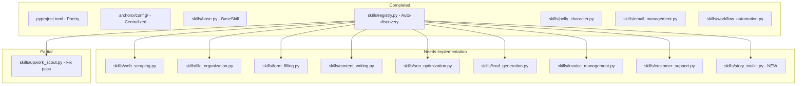

# ArchonX Skills Completion Plan
## Analysis & One-Shot Update Prompt

**Created:** 2026-02-19  
**Status:** Ready for Implementation  
**Previous Agent:** Ran out of tokens during implementation

---

## 📊 COMPLETED BY PREVIOUS AGENT

### Infrastructure ✅
| Item | Status | File |
|------|--------|------|
| Poetry Migration | ✅ Complete | [`pyproject.toml`](pyproject.toml) |
| Centralized Config | ✅ Complete | [`archonx/config/archonx-config.json`](archonx/config/archonx-config.json) |
| Kernel Config Path | ✅ Updated | [`archonx/kernel.py:40`](archonx/kernel.py:40) |
| Skills Base Class | ✅ Complete | [`archonx/skills/base.py`](archonx/skills/base.py) |
| Skills Registry | ✅ Complete | [`archonx/skills/registry.py`](archonx/skills/registry.py) |

### Implemented Skills ✅
| Skill | Status | Implementation Quality |
|-------|--------|----------------------|
| [`polly_character.py`](archonx/skills/polly_character.py) | ✅ Complete | Full MASTER_PROMPT, mock generation |
| [`email_management.py`](archonx/skills/email_management.py) | ✅ Complete | Full action handling, validation |
| [`workflow_automation.py`](archonx/skills/workflow_automation.py) | ✅ Complete | Skill chaining, context passing |
| [`upwork_scout.py`](archonx/skills/upwork_scout.py) | ⚠️ Partial | Has `pass` statement at line 134 |

---

## 🔴 GAPS IDENTIFIED

### Stub Skills (Return Empty Data)
| Skill | File | Missing Implementation |
|-------|------|----------------------|
| Web Scraping | [`web_scraping.py`](archonx/skills/web_scraping.py) | httpx + BeautifulSoup logic |
| File Organization | [`file_organization.py`](archonx/skills/file_organization.py) | Actual file operations |
| Form Filling | [`form_filling.py`](archonx/skills/form_filling.py) | Computer-use integration |
| Content Writing | [`content_writing.py`](archonx/skills/content_writing.py) | LLM content generation |
| SEO Optimization | [`seo_optimization.py`](archonx/skills/seo_optimization.py) | SEO audit logic |
| Lead Generation | [`lead_generation.py`](archonx/skills/lead_generation.py) | Lead search/qualify logic |
| Invoice Management | [`invoice_management.py`](archonx/skills/invoice_management.py) | Stripe/integration |
| Customer Support | [`customer_support.py`](archonx/skills/customer_support.py) | Ticket handling logic |

### Code Issues
| Issue | File | Line | Description |
|-------|------|------|-------------|
| `pass` statement | [`upwork_scout.py`](archonx/skills/upwork_scout.py) | 134 | Remotion tool call not implemented |

### StoryToolkitAI Integration
- **Location:** [`n8n-workflows/StoryToolkitAI-main/`](n8n-workflows/StoryToolkitAI-main/)
- **Key Assets:**
  - `api-polly-generate.js` - Image generation API
  - `Pauli-Automation-Studio/prompt.master.txt` - Polly character prompts
  - `StoryToolkitAI-main/storytoolkitai/` - Full Python implementation
- **Action Required:** Create global skill wrapper for StoryToolkitAI

---

## 🎯 ONE-SHOT UPDATE PROMPT

```
You are continuing work on the ArchonX OS repository. A previous agent completed the infrastructure setup but ran out of tokens before finishing the skills implementations.

## COMPLETED (DO NOT MODIFY)
- pyproject.toml - Poetry migration complete
- archonx/config/archonx-config.json - Centralized config
- archonx/kernel.py - Config path updated
- archonx/skills/base.py - BaseSkill, SkillContext, SkillResult with metadata
- archonx/skills/registry.py - Auto-discovery implemented
- archonx/skills/polly_character.py - Full implementation
- archonx/skills/email_management.py - Full implementation
- archonx/skills/workflow_automation.py - Full implementation

## REQUIRED IMPLEMENTATIONS

### 1. Fix upwork_scout.py (Line 134)
Replace the `pass` statement with actual Remotion tool integration:
```python
# Line 134 in _generate_video_proposal method
if remotion_tool:
    render_result = await remotion_tool.execute({
        "template": "video_proposal",
        "job_data": job_url,
        "sections": ["intro", "problem", "solution", "portfolio", "cta"]
    })
    return {
        "job_url": job_url,
        "video_proposal": render_result
    }
```

### 2. Implement web_scraping.py
Add httpx + BeautifulSoup implementation:
- Use httpx.AsyncClient for HTTP requests
- Parse HTML with BeautifulSoup
- Support CSS selectors and XPath
- Handle pagination and rate limiting
- Return structured data

### 3. Implement file_organization.py
Add actual file operations:
- Use pathlib for cross-platform paths
- Support organize/rename/tag/archive actions
- Handle file conflicts safely
- Return operation summary

### 4. Implement form_filling.py
Add computer-use integration:
- Use context.tools.get("computer_use") if available
- Support form field mapping
- Handle dropdowns, checkboxes, text inputs
- Return filled fields summary

### 5. Implement content_writing.py
Add LLM content generation:
- Use context.tools for LLM access
- Support blog/article/copy/social types
- Apply tone and style parameters
- Return generated content

### 6. Implement seo_optimization.py
Add SEO audit logic:
- Check meta tags, headings, alt text
- Analyze keyword density
- Check page speed indicators
- Return prioritized recommendations

### 7. Implement lead_generation.py
Add lead search/qualify logic:
- Support multiple sources (LinkedIn, directories)
- Implement scoring criteria
- Handle outreach templates
- Return qualified leads list

### 8. Implement invoice_management.py
Add Stripe/integration:
- Support create/send/track/remind actions
- Use Stripe API if configured
- Handle PDF generation
- Return invoice status

### 9. Implement customer_support.py
Add ticket handling logic:
- Support respond/escalate/resolve/track actions
- Use context.tools for LLM responses
- Handle priority routing
- Return ticket status

### 10. Create StoryToolkitAI Global Skill
Create archonx/skills/story_toolkit.py:
- Wrap n8n-workflows/StoryToolkitAI-main functionality
- Expose video processing, transcription, story analysis
- Register as global skill in kernel.py

## IMPLEMENTATION PATTERN
Each skill should:
1. Import required dependencies (httpx, logging, etc.)
2. Use the existing BaseSkill interface
3. Return SkillResult with status, data, metadata
4. Log operations for debugging
5. Handle errors gracefully
6. Report improvements_found for flywheel

## FILES TO MODIFY
1. archonx/skills/web_scraping.py
2. archonx/skills/file_organization.py
3. archonx/skills/form_filling.py
4. archonx/skills/content_writing.py
5. archonx/skills/seo_optimization.py
6. archonx/skills/lead_generation.py
7. archonx/skills/invoice_management.py
8. archonx/skills/customer_support.py
9. archonx/skills/upwork_scout.py (line 134 only)
10. archonx/skills/story_toolkit.py (NEW FILE)
11. archonx/kernel.py (register story_toolkit skill)

Begin implementation now. Complete all stub implementations with production-ready code.
```

---

## 📐 ARCHITECTURE DIAGRAM



---

## ✅ ACCEPTANCE CRITERIA

Each skill implementation must:
- [ ] Follow the BaseSkill interface pattern
- [ ] Return meaningful data (not empty dicts)
- [ ] Include proper error handling
- [ ] Log operations for debugging
- [ ] Support all documented actions
- [ ] Pass mypy strict type checking
- [ ] Have corresponding test file

---

## 🚀 NEXT STEPS

1. Switch to Code mode
2. Apply the one-shot update prompt
3. Implement all stub skills
4. Fix the upwork_scout.py pass statement
5. Create story_toolkit.py global skill
6. Run tests to verify implementations
7. Update kernel.py to register new skill

---

**Plan Status:** Ready for Implementation  
**Estimated Files to Modify:** 11  
**Risk Level:** Low (following established patterns)
