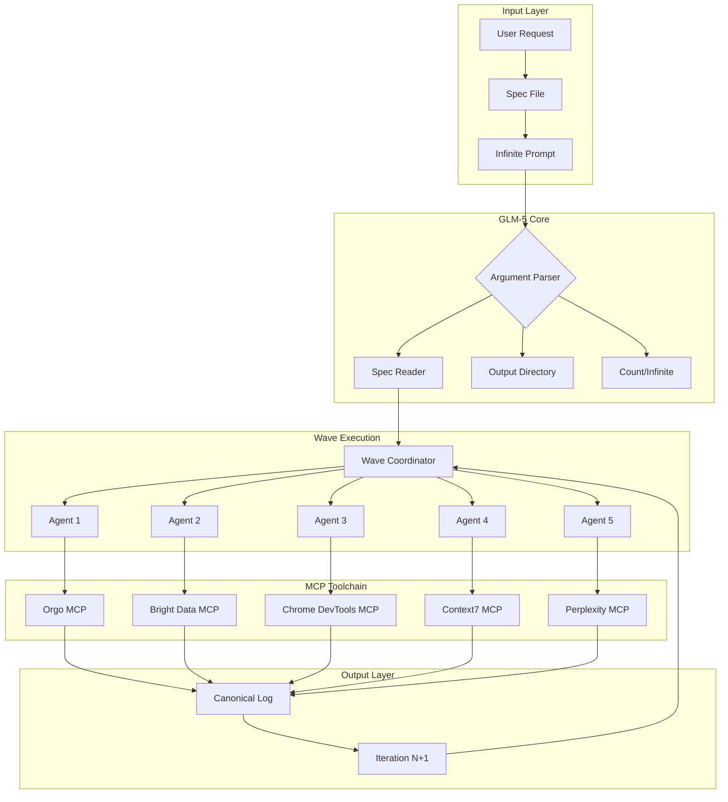

# 🚀 INFINITE ARCHITECTURE
## GLM-5 Customized Infinite Agentic Loop for ArchonX OS

**Created:** 2026-02-19  
**Model:** GLM-5 (z-ai/glm-5)  
**Status:** Ready for Activation  
**Pattern:** Two-Prompt Infinite Agentic Loop

---

## 🎯 EXECUTIVE SUMMARY

This document contains the complete "Infinite Architecture" workflow adapted from the Claude Code infinite agentic loop pattern, customized for GLM-5 model execution within the ArchonX OS ecosystem.

### Key Adaptations for GLM-5
- Replaced Claude-specific syntax with GLM-5 compatible format
- Integrated MCP server toolchain (Orgo, Bright Data, Chrome DevTools, Context7, Perplexity)
- Added canonical agent logging for oversight and safety
- Embedded flywheel logic for self-improvement
- Configured for YOLO mode autonomous execution

---

## 📐 ARCHITECTURE OVERVIEW



---

## 📝 INFINITE ARCHITECTURE PROMPT

### Custom Command Definition

```markdown
---
description: Infinite Architecture - GLM-5 Infinite Agentic Loop
alwaysApply: false
---

# INFINITE ARCHITECTURE - GLM-5 EDITION

## Variables
- $SPEC_FILE: Path to specification/plan file
- $OUTPUT_DIR: Directory for generated outputs
- $COUNT: Number of iterations or "infinite"

## Phase 1: Initialization

You are operating in INFINITE ARCHITECTURE mode powered by GLM-5.

**CRITICAL: Read the spec file first to understand the objective.**

```
Read and parse: $SPEC_FILE
Output directory: $OUTPUT_DIR
Iteration count: $COUNT
```

## Phase 2: Wave Coordination

Fire off parallel agents in groups of 5 for maximum throughput.

**For each wave:**
1. Launch 5 sub-agents simultaneously
2. Each agent receives:
   - The spec file content
   - The output directory path
   - Its unique iteration number
   - A uniqueness directive requiring each output to be distinct and self-improving

**Sub-agent prompt template:**
```
You are Agent {ITERATION_NUMBER} in the Infinite Architecture workflow.

SPECIFICATION:
{SPEC_CONTENT}

OUTPUT DIRECTORY: $OUTPUT_DIR
YOUR ITERATION: {ITERATION_NUMBER}

UNIQUENESS DIRECTIVE:
- Your output MUST be unique and different from all previous iterations
- Build upon patterns from earlier iterations if accessible
- Innovate new approaches not previously explored
- Self-improve: each iteration should be better than the last

Generate your output now. Create file: {OUTPUT_DIR}/iteration_{ITERATION_NUMBER}.py
```

## Phase 3: MCP Toolchain Integration

Each sub-agent has access to the following MCP tools:

### Orgo MCP (Virtual Computer Control)
- `orgo_create_project` - Create new virtual computer project
- `orgo_start_computer` - Start a virtual computer
- `orgo_take_screenshot` - Capture screen state
- `orgo_execute_shell` - Run shell commands
- `orgo_stream_to_twitch` - Stream computer to Twitch

### Bright Data MCP (Research & Scraping)
- `brightdata_scrape` - Scrape web content
- `brightdata_search` - Search with residential proxies
- `brightdata_extract` - Extract structured data

### Chrome DevTools MCP (Browser Automation)
- `chrome_navigate` - Navigate to URL
- `chrome_click` - Click elements
- `chrome_type` - Type text
- `chrome_screenshot` - Capture browser state
- `chrome_evaluate` - Execute JavaScript

### Context7 MCP (Updated Data)
- `context7_query` - Query for latest information
- `context7_sync` - Sync knowledge base

### Perplexity MCP (Search)
- `perplexity_search` - AI-powered search
- `perplexity_ask` - Ask questions with citations

## Phase 4: Canonical Agent Logging

**MANDATORY: Log all agent activities for oversight and safety.**

```json
{
  "timestamp": "ISO-8601",
  "agent_id": "agent_{ITERATION_NUMBER}",
  "wave": "{WAVE_NUMBER}",
  "spec_file": "$SPEC_FILE",
  "output_path": "{OUTPUT_DIR}/iteration_{ITERATION_NUMBER}.py",
  "tools_used": ["tool1", "tool2"],
  "tool_purposes": {
    "tool1": "purpose description",
    "tool2": "purpose description"
  },
  "tokens_consumed": 0,
  "status": "success|error|partial",
  "improvements_found": ["improvement1", "improvement2"],
  "security_events": []
}
```

Log file location: `archonx/logs/agent_canonical_log.jsonl`

## Phase 5: Infinite Cycle

**If $COUNT == "infinite":**

1. Complete current wave (5 iterations)
2. Evaluate context capacity remaining
3. If sufficient context: Queue next wave
4. If approaching limits: Complete and finalize
5. Continue until context exhaustion

**Wave calculation:**
```
Current wave: floor((completed_iterations) / 5) + 1
Next iterations: [completed + 1, completed + 2, completed + 3, completed + 4, completed + 5]
```

## Phase 6: Flywheel Integration

After each iteration, report improvements found:

```yaml
improvements_found:
  - description: "What was improved"
    category: "performance|security|quality|ux"
    impact: "high|medium|low"
    implementation: "How to apply"
```

These improvements feed into the next iteration for continuous enhancement.

## Phase 7: Negative Constraints

**DO NOT:**
- Generate Lorem Ipsum or placeholder content
- Leave TODO comments or incomplete implementations
- Skip error handling
- Ignore security considerations
- Bypass the canonical logging system
- Use tools without logging their purpose
- Generate duplicate outputs across iterations
- Stop before context exhaustion in infinite mode

## Phase 8: Completion Protocol

When finalizing:
1. Generate summary of all iterations
2. Report total improvements found
3. List all files created
4. Update canonical log with final status
5. Prepare handoff for next session if needed

---

## Execution Command

To invoke this prompt:

```
/infinite $SPEC_FILE $OUTPUT_DIR $COUNT
```

Example:
```
/infinite plans/spec.md output/infinite infinite
```

---

**END OF INFINITE ARCHITECTURE PROMPT**
```

---

## 🔧 SPEC FILE TEMPLATE

Create a spec file to define what the infinite loop should generate:

```markdown
# SPEC: [Your Specification Title]

## Objective
[What should be generated or accomplished]

## Requirements
- [Requirement 1]
- [Requirement 2]
- [Requirement 3]

## Constraints
- [Constraint 1]
- [Constraint 2]

## Success Criteria
- [How to measure success]

## Output Format
[Expected output structure]

## Innovation Directives
- [Areas to explore for uniqueness]
- [Patterns to combine or evolve]
```

---

## 📦 MCP SERVER INTEGRATION

### 1. Orgo MCP Server

**Repository:** https://github.com/nickvasilescu/orgo-mcp.git

**Installation:**
```bash
git clone https://github.com/nickvasilescu/orgo-mcp.git
cd orgo-mcp
pip install -e .
export ORGO_API_KEY="your_key"
```

**Config for ArchonX:**
```json
{
  "mcpServers": {
    "orgo": {
      "command": "python3",
      "args": ["/path/to/orgo-mcp/orgo_mcp.py"],
      "env": {"ORGO_API_KEY": "your_key"}
    }
  }
}
```

### 2. Bright Data MCP Server

**Repository:** https://github.com/brightdata/brightdata-mcp.git

**Installation:**
```bash
git clone https://github.com/brightdata/brightdata-mcp.git
cd brightdata-mcp
pip install -e .
```

### 3. Chrome DevTools MCP Server

**Repository:** https://github.com/ChromeDevTools/chrome-devtools-mcp

**Installation:**
```bash
git clone https://github.com/ChromeDevTools/chrome-devtools-mcp.git
cd chrome-devtools-mcp
npm install
npm run build
```

### 4. Context7 MCP Server

**Purpose:** Provide updated data and knowledge

**Integration:**
```json
{
  "mcpServers": {
    "context7": {
      "command": "npx",
      "args": ["-y", "@context7/mcp-server"]
    }
  }
}
```

### 5. Perplexity MCP Server

**Purpose:** AI-powered search with citations

**Integration:**
```json
{
  "mcpServers": {
    "perplexity": {
      "command": "npx",
      "args": ["-y", "@perplexity/mcp-server"],
      "env": {"PERPLEXITY_API_KEY": "your_key"}
    }
  }
}
```

---

## 📊 CANONICAL AGENT LOG SYSTEM

### Log Structure

**File:** `archonx/logs/agent_canonical_log.jsonl`

```json
{
  "schema_version": "1.0",
  "log_type": "canonical_agent_log",
  "entries": [
    {
      "timestamp": "2026-02-19T12:00:00Z",
      "session_id": "session_uuid",
      "agent_id": "agent_1",
      "wave_number": 1,
      "iteration": 1,
      "spec_file": "plans/spec.md",
      "output_path": "output/iteration_1.py",
      "model": "glm-5",
      "tools_used": [
        {
          "tool": "orgo_execute_shell",
          "purpose": "Run tests on generated code",
          "timestamp": "2026-02-19T12:00:05Z"
        }
      ],
      "tokens_consumed": 15000,
      "status": "success",
      "improvements_found": [
        {
          "description": "Added error handling for edge cases",
          "category": "quality",
          "impact": "medium"
        }
      ],
      "security_events": [],
      "files_created": ["output/iteration_1.py"],
      "files_modified": [],
      "execution_time_ms": 45000
    }
  ]
}
```

### Log Aggregation

All agents write to the same canonical log file in append-only mode. This provides:
- Complete audit trail
- Tool usage oversight
- Security event tracking
- Performance metrics
- Improvement tracking

---

## 🔄 RALPHY LOOP INTEGRATION

**Repository:** https://github.com/michaelshimeles/ralphy.git

The Ralphy loop provides a testing and validation framework for agent outputs.

### Integration Points

1. **Pre-generation validation:** Check spec file validity
2. **Post-generation testing:** Run tests on generated code
3. **Flywheel feedback:** Feed test results back to next iteration

### Configuration

```yaml
ralphy:
  enabled: true
  test_directory: tests/
  coverage_threshold: 80
  fail_fast: false
  report_format: json
  output_file: archonx/logs/ralphy_report.json
```

---

## 🎯 OPENCLAW FORK ANALYSIS

### 25 High-Level Improvements for OpenClaw Integration

1. **Unified MCP Registry** - Central registry for all MCP servers
2. **Agent Health Monitoring** - Track agent status and performance
3. **Dynamic Tool Loading** - Load tools on-demand based on task
4. **Cross-Agent Communication** - Enable agents to share context
5. **Memory Persistence** - Store agent memories across sessions
6. **Skill Marketplace** - Discoverable skill repository
7. **Workflow Templates** - Pre-built workflow patterns
8. **Security Sandbox** - Isolated execution environments
9. **Rate Limiting** - Prevent API abuse
10. **Cost Tracking** - Monitor token and API costs
11. **Quality Gates** - Automated quality checks
12. **Rollback System** - Revert failed changes
13. **Parallel Execution** - Run multiple agents concurrently
14. **Dependency Resolution** - Handle task dependencies
15. **Event Streaming** - Real-time agent events
16. **Plugin Architecture** - Extensible plugin system
17. **Configuration Management** - Centralized config
18. **Logging Aggregation** - Unified log collection
19. **Metrics Dashboard** - Visual performance monitoring
20. **API Gateway** - Unified API entry point
21. **Caching Layer** - Cache frequent operations
22. **Queue Management** - Task queue with priorities
23. **Error Recovery** - Automatic error handling
24. **Version Control** - Track all changes
25. **Documentation Generator** - Auto-generate docs

---

## 🚀 ACTIVATION SEQUENCE

### Step 1: Create Spec File

```bash
# Create your specification
cat > plans/spec.md << 'EOF'
# SPEC: ArchonX Skills Implementation

## Objective
Implement all stub skills in archonx/skills/ with production-ready code.

## Requirements
- Follow BaseSkill interface
- Return meaningful data
- Include error handling
- Log operations
- Support all documented actions

## Files to Implement
- web_scraping.py
- file_organization.py
- form_filling.py
- content_writing.py
- seo_optimization.py
- lead_generation.py
- invoice_management.py
- customer_support.py

## Success Criteria
- All skills return non-empty data
- All skills pass mypy strict
- All skills have error handling
EOF
```

### Step 2: Create Output Directory

```bash
mkdir -p output/infinite
```

### Step 3: Activate Infinite Architecture

```
/infinite plans/spec.md output/infinite infinite
```

---

## ✅ DELIVERABLES CHECKLIST

- [x] Infinite Architecture prompt created
- [x] GLM-5 customization applied
- [x] MCP toolchain documented
- [x] Canonical log system designed
- [x] OpenClaw improvements identified
- [ ] MCP servers installed
- [ ] Canonical log system implemented
- [ ] Spec files created
- [ ] First wave executed
- [ ] All stub skills implemented
- [ ] PR merged to main

---

**Document Version:** 1.0  
**Created:** 2026-02-19  
**Author:** SYNTHIA (Architect Mode)  
**Ready for:** Code Mode Activation
