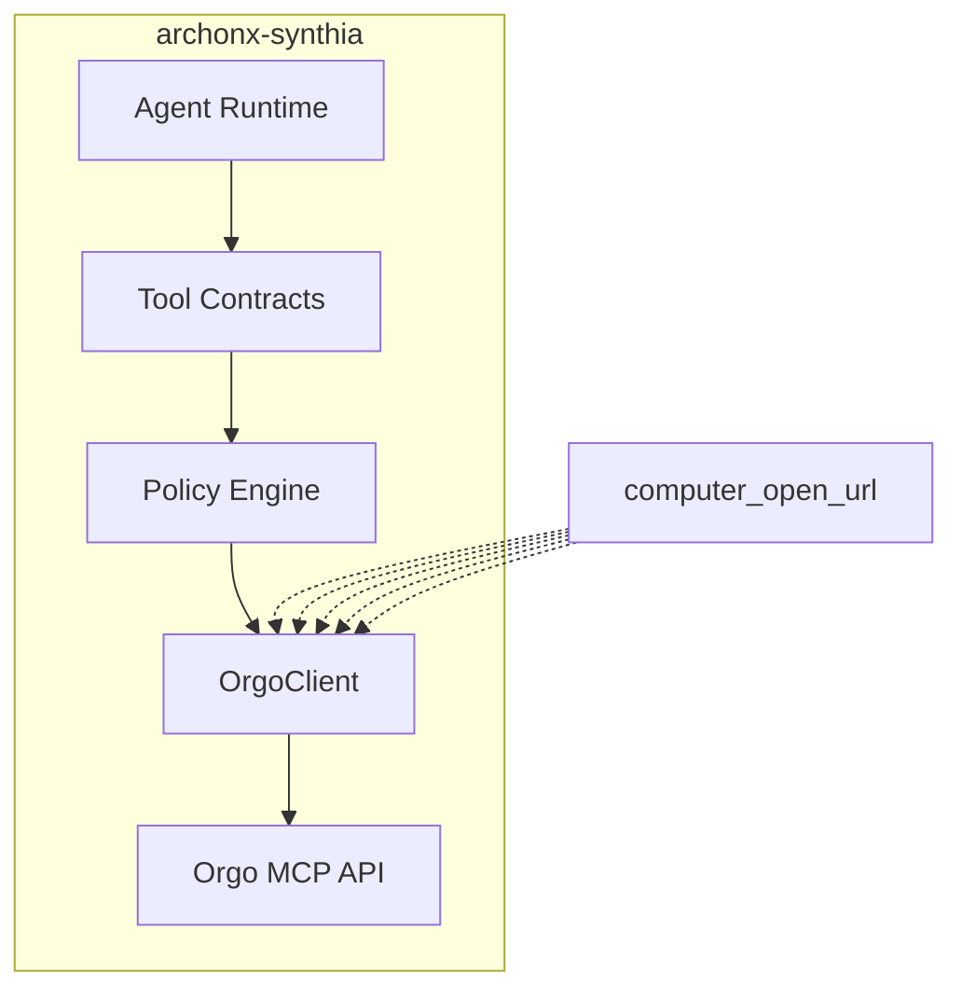

# Orgo MCP Integration Plan for SYNTHIA

## Context

**Current Location:** `archonx-synthia/` subdirectory of ArchonX OS  
**Integration Target:** Orgo MCP (https://github.com/nickvasilescu/orgo-mcp.git)  
**Documentation:** https://docs.orgo.ai/introduction  
**Existing Code:** [`archonx-synthia/packages/connectors/orgo_client.py`](archonx-synthia/packages/connectors/orgo_client.py) - STUB implementation

## Current State

The OrgoClient in archonx-synthia is a **stub** with these methods:
- `create_computer()` - Returns mock computer_id
- `destroy_computer()` - Mock destroy
- `get_computer_status()` - Mock status
- `screenshot()` - Returns empty base64
- `input()` - Mock action execution
- `open_url()` - Mock navigation

## Purpose of Orgo MCP

Based on the Orgo MCP repository and documentation, Orgo provides **computer-use capabilities** - ephemeral desktop instances that AI agents can control programmatically for:
- Browser automation
- Desktop application control
- Screen capture and interaction
- Autonomous web tasks

## Integration Requirements

### Phase 1: Full Orgo MCP Implementation
- [ ] Replace stub with real API implementation
- [ ] Implement actual HTTP calls to Orgo API
- [ ] Handle authentication (API keys)
- [ ] Implement proper error handling

### Phase 2: Tool Contracts
- [ ] Define Orgo MCP tool definitions in [`archonx-synthia/packages/schemas/tool_definitions.json`](archonx-synthia/packages/schemas/tool_definitions.json)
- [ ] Map Orgo capabilities to SYNTHIA agent tools
- [ ] Create tool contracts for agent runtime

### Phase 3: Agent Integration
- [ ] Integrate OrgoClient into agent_runtime
- [ ] Connect Orgo tools to policy engine
- [ ] Enable autonomous computer-use for SYNTHIA

## Architecture

## Next Steps

1. **Analyze Orgo MCP repository** - Clone and examine the MCP server implementation
2. **Review Orgo API docs** - Understand authentication, endpoints, capabilities
3. **Implement full OrgoClient** - Replace stub with production code
4. **Define tool contracts** - Register Orgo tools in SYNTHIA
5. **Connect to agent runtime** - Enable autonomous computer-use
